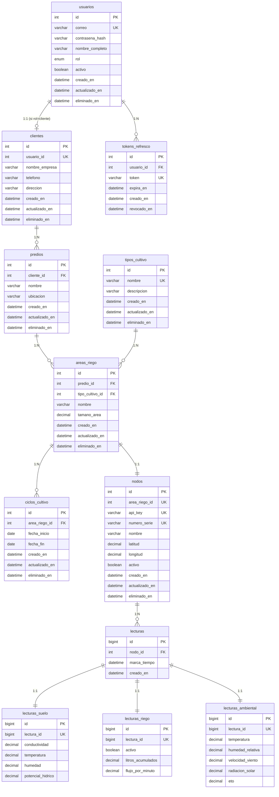

# ROL Y OBJETIVO
Actúa como un Arquitecto de Base de Datos Senior. Este documento define el schema completo de MySQL 8 para el MVP del sistema IoT de monitoreo de riego agrícola. Toda implementación de modelos SQLAlchemy, migraciones Alembic y queries debe apegarse estrictamente a este diseño.

---

# 0. CONTEXTO DEL SISTEMA

## ¿Qué es este sistema?
Una plataforma web para monitorear sensores de riego agrícola en tiempo real. Los agricultores (clientes) tienen **predios** (terrenos), cada predio tiene **áreas de riego** (parcelas con un cultivo específico), y cada área tiene un **nodo IoT** (sensor físico) que envía datos cada 10 minutos.

## ¿Qué datos captura?
Cada nodo IoT envía **12 campos** organizados en **3 categorías**:
- **Suelo** (4 campos): conductividad, temperatura, humedad ⭐, potencial hídrico
- **Riego** (3 campos): activo (on/off), litros acumulados, flujo por minuto ⭐
- **Ambiental** (5 campos): temperatura, humedad relativa, viento, radiación solar, ETO ⭐

> Los campos marcados con ⭐ son los **datos prioritarios** para el cliente.

## Jerarquía de entidades (de arriba hacia abajo)
```
👤 Cliente (agricultor)
 └── 🏡 Predio (terreno/rancho)
      └── 🌱 Área de Riego (parcela con un cultivo)
           ├── 📋 Tipo de Cultivo (del catálogo: Nogal, Alfalfa, etc.)
           ├── 📅 Ciclos de Cultivo (temporadas: 2025, 2026...)
           └── 📡 Nodo IoT (sensor físico, relación 1:1)
                └── 📊 Lecturas (cada 10 min = 144/día)
                     ├── 🟤 Lectura Suelo
                     ├── 💧 Lectura Riego
                     └── 🌤️ Lectura Ambiental
```

## Roles del sistema
| Rol | Acceso | Responsabilidad |
|-----|--------|-----------------|
| **Admin** | Todo el sistema | Gestiona clientes, predios, áreas, nodos, catálogo de cultivos y ciclos. Puede ver datos de cualquier cliente. |
| **Cliente** | Solo sus datos | Ve dashboard, histórico y exporta datos de sus propios predios y áreas. |
| **Nodo IoT** | Solo escritura | Envía lecturas cada 10 min via POST con API Key. No tiene interfaz web. |

## Flujo de datos
```
Simulador → POST /api/v1/readings (X-API-Key) → Backend valida API Key
  → INSERT en tabla lecturas (parent)
  → INSERT en lecturas_suelo
  → INSERT en lecturas_riego
  → INSERT en lecturas_ambiental
  → Todo en una sola transacción atómica
```

```
Cliente abre dashboard → Frontend pide GET /api/v1/readings (JWT)
  → Backend verifica permisos (solo sus predios/áreas)
  → SELECT con JOINs a las 3 tablas de categoría
  → Responde JSON con los 12 campos + marca_tiempo
```

## Volumen estimado
- **144 lecturas/día** por nodo (1 cada 10 minutos)
- Cada lectura = 1 fila en `lecturas` + 1 en cada tabla de categoría (4 filas total)
- Con 10 nodos: **1,440 lecturas/día** → **525,600/año** → por eso los IDs son BIGINT

---

# 1. DECISIONES DE DISEÑO

| Decisión | Elección | Justificación |
|----------|----------|---------------|
| Relación Usuario-Cliente | Tablas separadas `usuarios` + `clientes` | Separar auth de datos de negocio. Extensible. |
| Campo "tamaño" | En `areas_riego.tamano_area` | Es la superficie del terreno irrigado, pertenece al área. |
| Almacenamiento de lecturas | 3 tablas por categoría + tabla parent `lecturas` | Más normalizado. Permite consultas por categoría sin cargar datos innecesarios. |
| Eliminación | Soft delete (`eliminado_en`) en entidades principales | Preserva historial para trazabilidad y Fase 2 IA. |
| Catálogo de cultivos | Tabla `tipos_cultivo` con CRUD (administrable por Admin) | Valores iniciales como seed. Admin agrega/edita/elimina. |
| Auditoría | `creado_en` + `actualizado_en` en todas las tablas | Trazabilidad completa. |
| IDs de lecturas | BIGINT | Alto volumen: 144 lecturas/día × N nodos. |
| Timestamps | DATETIME en UTC | ISO 8601. Sin timezone en BD, siempre UTC. |
| Nomenclatura | Tablas y columnas en **español** | Legibilidad para el equipo. Los endpoints de API y payload JSON se mantienen en inglés según AGENTS.md. |

# 2. MAPEO TABLAS / COLUMNAS → API

> Las tablas y columnas están en español, pero la API REST y el payload JSON del sensor se mantienen en **inglés** según las convenciones de AGENTS.md. El mapeo se hace en la capa de serialización (schemas Pydantic).

| Tabla (BD) | Endpoint (API) |
|------------|----------------|
| `usuarios` | `/api/v1/users` |
| `clientes` | `/api/v1/clients` |
| `predios` | `/api/v1/properties` |
| `tipos_cultivo` | `/api/v1/crop-types` |
| `areas_riego` | `/api/v1/irrigation-areas` |
| `ciclos_cultivo` | `/api/v1/crop-cycles` |
| `nodos` | `/api/v1/nodes` |
| `lecturas` | `/api/v1/readings` |

# 3. SCHEMA DE TABLAS (12 tablas)

> **Convenciones usadas en todas las tablas:**
> - `creado_en` — Fecha/hora de creación del registro (automático).
> - `actualizado_en` — Fecha/hora de la última modificación (automático).
> - `eliminado_en` — Si tiene valor, el registro está "eliminado" lógicamente (soft delete). Las queries normales lo filtran con `WHERE eliminado_en IS NULL`.
> - Todos los timestamps se almacenan en **UTC**.
> - `NULL` en un campo significa "no proporcionado" o "no aplica".

## 3.1. `usuarios` — Autenticación y acceso

**¿Qué guarda?** Las credenciales de login y el rol de cada persona que accede a la plataforma web (admins y clientes). No guarda datos de negocio del cliente — esos van en la tabla `clientes`.

**¿Quién crea registros aquí?** El Admin, al dar de alta a un nuevo usuario.

```sql
CREATE TABLE usuarios (
    id                  INT AUTO_INCREMENT PRIMARY KEY,
    correo              VARCHAR(255) NOT NULL UNIQUE,
    contrasena_hash     VARCHAR(255) NOT NULL,
    nombre_completo     VARCHAR(150) NOT NULL,
    rol                 ENUM('admin', 'cliente') NOT NULL,
    activo              BOOLEAN NOT NULL DEFAULT TRUE,
    creado_en           DATETIME NOT NULL DEFAULT CURRENT_TIMESTAMP,
    actualizado_en      DATETIME NOT NULL DEFAULT CURRENT_TIMESTAMP ON UPDATE CURRENT_TIMESTAMP,
    eliminado_en        DATETIME NULL DEFAULT NULL,

    INDEX idx_usuarios_correo (correo),
    INDEX idx_usuarios_rol (rol)
);
```

> **Notas:** `rol` define permisos. `activo` permite deshabilitar sin borrar. `eliminado_en` para soft delete. Un usuario con rol='cliente' debe tener un registro asociado en `clientes`.

**Ejemplo de datos:**
| id | correo | nombre_completo | rol | activo |
|----|--------|-----------------|-----|--------|
| 1 | admin@sensores.com | Administrador | admin | true |
| 2 | jlopez@correo.com | Juan López | cliente | true |
| 3 | mgarcia@correo.com | María García | cliente | true |

## 3.2. `tokens_refresco` — Sesiones JWT

**¿Qué guarda?** Los refresh tokens activos de cada usuario. Cuando un usuario hace login, se genera un token que le permite renovar su sesión sin volver a ingresar contraseña. Cuando hace logout o el token se rota, se marca como `revocado_en`.

**¿Quién crea registros aquí?** El sistema automáticamente, cada vez que un usuario hace login o renueva su sesión.

```sql
CREATE TABLE tokens_refresco (
    id              INT AUTO_INCREMENT PRIMARY KEY,
    usuario_id      INT NOT NULL,
    token           VARCHAR(512) NOT NULL UNIQUE,
    expira_en       DATETIME NOT NULL,
    creado_en       DATETIME NOT NULL DEFAULT CURRENT_TIMESTAMP,
    revocado_en     DATETIME NULL DEFAULT NULL,

    INDEX idx_tokens_refresco_token (token),
    INDEX idx_tokens_refresco_usuario_id (usuario_id),

    CONSTRAINT fk_tokens_refresco_usuario
        FOREIGN KEY (usuario_id) REFERENCES usuarios(id) ON DELETE CASCADE
);
```

> **Notas:** `revocado_en` != NULL indica token revocado (logout o rotación). ON DELETE CASCADE: si se borra el usuario, se borran sus tokens.

## 3.3. `clientes` — Datos de negocio del agricultor

**¿Qué guarda?** La información comercial/de contacto del agricultor: nombre de la empresa, teléfono, dirección. Va separado de `usuarios` porque un admin también es usuario pero NO es cliente.

**¿Quién crea registros aquí?** El Admin, al registrar un nuevo cliente. Se crea junto con su registro en `usuarios` (rol='cliente').

**Relación:** Cada cliente tiene exactamente 1 usuario (1:1). El `usuario_id` es UNIQUE.

```sql
CREATE TABLE clientes (
    id                  INT AUTO_INCREMENT PRIMARY KEY,
    usuario_id          INT NOT NULL UNIQUE,
    nombre_empresa      VARCHAR(200) NOT NULL,
    telefono            VARCHAR(30) NULL DEFAULT NULL,
    direccion           TEXT NULL DEFAULT NULL,
    creado_en           DATETIME NOT NULL DEFAULT CURRENT_TIMESTAMP,
    actualizado_en      DATETIME NOT NULL DEFAULT CURRENT_TIMESTAMP ON UPDATE CURRENT_TIMESTAMP,
    eliminado_en        DATETIME NULL DEFAULT NULL,

    INDEX idx_clientes_usuario_id (usuario_id),

    CONSTRAINT fk_clientes_usuario
        FOREIGN KEY (usuario_id) REFERENCES usuarios(id) ON DELETE CASCADE
);
```

> **Notas:** Relación 1:1 con `usuarios` (UNIQUE en usuario_id). Contiene datos de negocio que no pertenecen a la tabla de auth. ON DELETE CASCADE: si se borra el usuario, se borra el cliente.

**Ejemplo de datos:**
| id | usuario_id | nombre_empresa | telefono | direccion |
|----|-----------|----------------|----------|-----------|
| 1 | 2 | Agrícola López S.A. | 614-555-1234 | Km 5 Carretera Delicias |
| 2 | 3 | Rancho García | 614-555-5678 | Av. Tecnológico #200, Chihuahua |

## 3.4. `predios` — Predios / Terrenos

**¿Qué guarda?** Cada terreno o rancho que posee un cliente. Un cliente puede tener varios predios en diferentes ubicaciones.

**¿Quién crea registros aquí?** El Admin, al configurar los terrenos de un cliente.

```sql
CREATE TABLE predios (
    id              INT AUTO_INCREMENT PRIMARY KEY,
    cliente_id      INT NOT NULL,
    nombre          VARCHAR(150) NOT NULL,
    ubicacion       VARCHAR(255) NULL DEFAULT NULL,
    creado_en       DATETIME NOT NULL DEFAULT CURRENT_TIMESTAMP,
    actualizado_en  DATETIME NOT NULL DEFAULT CURRENT_TIMESTAMP ON UPDATE CURRENT_TIMESTAMP,
    eliminado_en    DATETIME NULL DEFAULT NULL,

    INDEX idx_predios_cliente_id (cliente_id),

    CONSTRAINT fk_predios_cliente
        FOREIGN KEY (cliente_id) REFERENCES clientes(id) ON DELETE CASCADE
);
```

> **Notas:** Un cliente posee 1 o más predios. `ubicacion` es descripción textual libre (ej. "Km 5 Carretera Delicias-Meoqui"). `nombre` es obligatorio (ej. "Rancho López").

**Ejemplo de datos:**
| id | cliente_id | nombre | ubicacion |
|----|-----------|--------|----------|
| 1 | 1 | Rancho Norte | Km 5 Carretera Delicias-Meoqui |
| 2 | 1 | Parcela Sur | Ejido Revolución, Delicias |
| 3 | 2 | Finca García | Carr. Chihuahua-Aldama Km 12 |

## 3.5. `tipos_cultivo` — Catálogo administrable de cultivos

**¿Qué guarda?** El catálogo de cultivos disponibles para asignar a las áreas de riego. Es una lista administrable — el Admin puede agregar nuevos cultivos o eliminar los que ya no se usen.

**¿Quién crea registros aquí?** El Admin. Los 6 iniciales se crean como seed data al instalar el sistema.

```sql
CREATE TABLE tipos_cultivo (
    id              INT AUTO_INCREMENT PRIMARY KEY,
    nombre          VARCHAR(50) NOT NULL UNIQUE,
    descripcion     VARCHAR(255) NULL DEFAULT NULL,
    creado_en       DATETIME NOT NULL DEFAULT CURRENT_TIMESTAMP,
    actualizado_en  DATETIME NOT NULL DEFAULT CURRENT_TIMESTAMP ON UPDATE CURRENT_TIMESTAMP,
    eliminado_en    DATETIME NULL DEFAULT NULL
);
```

> **Notas:** CRUD completo gestionado por el Admin. Soft delete obligatorio: no se puede borrar físicamente un cultivo que tiene áreas asignadas. `descripcion` opcional para notas del Admin. **Seed data:** Nogal, Alfalfa, Manzana, Maíz, Chile, Algodón.

**Ejemplo de datos (seed inicial):**
| id | nombre | descripcion |
|----|--------|------------|
| 1 | Nogal | Nogal pecanero |
| 2 | Alfalfa | NULL |
| 3 | Manzana | Manzana Golden Delicious |
| 4 | Maíz | NULL |
| 5 | Chile | Chile jalapeño y serrano |
| 6 | Algodón | NULL |

## 3.6. `areas_riego` — Áreas de Riego

**¿Qué guarda?** Cada parcela dentro de un predio que tiene un sistema de riego monitoreado. Es la **entidad central** del sistema — todo converge aquí: el cultivo que se siembra, el nodo que la monitorea, y los ciclos de temporada.

**¿Quién crea registros aquí?** El Admin, al configurar las áreas dentro de un predio.

```sql
CREATE TABLE areas_riego (
    id                  INT AUTO_INCREMENT PRIMARY KEY,
    predio_id           INT NOT NULL,
    tipo_cultivo_id     INT NOT NULL,
    nombre              VARCHAR(150) NOT NULL,
    tamano_area         DECIMAL(10,2) NULL DEFAULT NULL,
    creado_en           DATETIME NOT NULL DEFAULT CURRENT_TIMESTAMP,
    actualizado_en      DATETIME NOT NULL DEFAULT CURRENT_TIMESTAMP ON UPDATE CURRENT_TIMESTAMP,
    eliminado_en        DATETIME NULL DEFAULT NULL,

    INDEX idx_areas_riego_predio_id (predio_id),
    INDEX idx_areas_riego_tipo_cultivo_id (tipo_cultivo_id),

    CONSTRAINT fk_areas_riego_predio
        FOREIGN KEY (predio_id) REFERENCES predios(id) ON DELETE CASCADE,
    CONSTRAINT fk_areas_riego_tipo_cultivo
        FOREIGN KEY (tipo_cultivo_id) REFERENCES tipos_cultivo(id) ON DELETE RESTRICT
);
```

> **Notas:** `tamano_area` en hectáreas. `tipo_cultivo_id` apunta al catálogo administrable. ON DELETE RESTRICT en tipo_cultivo: no se puede eliminar un tipo de cultivo que tiene áreas asignadas (se debe usar soft delete). Un predio contiene 1 o más áreas.

**Ejemplo de datos:**
| id | predio_id | tipo_cultivo_id | nombre | tamano_area |
|----|----------|----------------|--------|------------|
| 1 | 1 | 1 | Nogal Norte | 15.50 |
| 2 | 1 | 2 | Alfalfa Poniente | 8.00 |
| 3 | 2 | 4 | Maíz Principal | 22.30 |

## 3.7. `ciclos_cultivo` — Ciclos de cultivo

**¿Qué guarda?** Las temporadas agrícolas de cada área. Cada ciclo tiene fecha de inicio y fin. Sirve para agrupar lecturas por temporada (ej. "¿Cómo se comportó la humedad en el ciclo 2025?"). Un área puede tener muchos ciclos (historial), pero solo **1 activo** a la vez.

**¿Quién crea registros aquí?** El Admin, al definir o cerrar una temporada.

**¿Cómo se usa para filtrar?** Cuando el cliente selecciona un ciclo, el sistema toma su `fecha_inicio` y `fecha_fin` y filtra las lecturas que caigan en ese rango. También se puede filtrar por rango libre de fechas sin usar ciclos.

```sql
CREATE TABLE ciclos_cultivo (
    id              INT AUTO_INCREMENT PRIMARY KEY,
    area_riego_id   INT NOT NULL,
    fecha_inicio    DATE NOT NULL,
    fecha_fin       DATE NULL DEFAULT NULL,
    creado_en       DATETIME NOT NULL DEFAULT CURRENT_TIMESTAMP,
    actualizado_en  DATETIME NOT NULL DEFAULT CURRENT_TIMESTAMP ON UPDATE CURRENT_TIMESTAMP,
    eliminado_en    DATETIME NULL DEFAULT NULL,

    INDEX idx_ciclos_cultivo_area_id (area_riego_id),
    INDEX idx_ciclos_cultivo_area_fechas (area_riego_id, fecha_fin),

    CONSTRAINT fk_ciclos_cultivo_area_riego
        FOREIGN KEY (area_riego_id) REFERENCES areas_riego(id) ON DELETE CASCADE
);
```

> **Notas:** `fecha_fin` NULL = ciclo activo. **Constraint lógica en backend:** solo 1 ciclo activo por área (fecha_fin IS NULL o fecha_fin > NOW()). Múltiples ciclos cerrados permitidos (historial). El filtrado por ciclo se traduce a: `WHERE lecturas.marca_tiempo BETWEEN ciclo.fecha_inicio AND ciclo.fecha_fin`. Soft delete con `eliminado_en` para mantener consistencia con las demás entidades principales.

**Ejemplo de datos:**
| id | area_riego_id | fecha_inicio | fecha_fin | Significado |
|----|--------------|-------------|----------|-------------|
| 1 | 1 | 2025-03-01 | 2025-11-15 | Ciclo 2025 del Nogal Norte (cerrado) |
| 2 | 1 | 2026-02-01 | NULL | Ciclo 2026 del Nogal Norte (**activo**) |
| 3 | 2 | 2026-01-15 | NULL | Ciclo 2026 de Alfalfa Poniente (**activo**) |

## 3.8. `nodos` — Nodos IoT

**¿Qué guarda?** Cada sensor físico (o simulado) que está instalado en campo. Tiene su API Key (credencial para enviar datos), ubicación GPS y un número de serie. Cada nodo está vinculado a exactamente **1 área de riego** (relación 1:1).

**¿Quién crea registros aquí?** El Admin, al registrar y vincular un nodo a un área.

```sql
CREATE TABLE nodos (
    id              INT AUTO_INCREMENT PRIMARY KEY,
    area_riego_id   INT NOT NULL UNIQUE,
    api_key         VARCHAR(128) NOT NULL UNIQUE,
    numero_serie    VARCHAR(100) NULL DEFAULT NULL UNIQUE,
    nombre          VARCHAR(150) NULL DEFAULT NULL,
    latitud         DECIMAL(10,7) NULL DEFAULT NULL,
    longitud        DECIMAL(10,7) NULL DEFAULT NULL,
    activo          BOOLEAN NOT NULL DEFAULT TRUE,
    creado_en       DATETIME NOT NULL DEFAULT CURRENT_TIMESTAMP,
    actualizado_en  DATETIME NOT NULL DEFAULT CURRENT_TIMESTAMP ON UPDATE CURRENT_TIMESTAMP,
    eliminado_en    DATETIME NULL DEFAULT NULL,

    INDEX idx_nodos_api_key (api_key),
    INDEX idx_nodos_area_riego_id (area_riego_id),

    CONSTRAINT fk_nodos_area_riego
        FOREIGN KEY (area_riego_id) REFERENCES areas_riego(id) ON DELETE CASCADE
);
```

> **Notas:** Relación 1:1 con `areas_riego` (UNIQUE en area_riego_id). `api_key` es el string único que el simulador envía en el header `X-API-Key`. `numero_serie` identificador físico opcional. `latitud`/`longitud` son datos estáticos de GPS registrados al configurar el nodo. `activo` permite deshabilitar un nodo sin borrarlo.

**Ejemplo de datos:**
| id | area_riego_id | api_key | nombre | latitud | longitud | activo |
|----|--------------|---------|--------|---------|----------|--------|
| 1 | 1 | ak_n01_a1b2c3d4e5f6 | Sensor Nogal Norte | 28.1867530 | -105.4714920 | true |
| 2 | 2 | ak_n02_f7g8h9i0j1k2 | Sensor Alfalfa Poniente | 28.1845210 | -105.4730150 | true |
| 3 | 3 | ak_n03_l3m4n5o6p7q8 | Sensor Maíz Principal | 28.6352140 | -106.0889360 | false |

## 3.9. `lecturas` — Tabla parent de cada evento de lectura

**¿Qué guarda?** El registro "maestro" de cada lectura: qué nodo la envió y cuándo fue tomada. Es la tabla parent que conecta con las 3 tablas de categoría (suelo, riego, ambiental). Cada vez que un nodo envía datos, se crea **1 fila aquí** + 1 fila en cada tabla de categoría.

**¿Quién crea registros aquí?** El sistema automáticamente, cada vez que un nodo envía un POST. El simulador envía 1 lectura cada 10 minutos = **144 lecturas/día por nodo**.

**Diferencia entre `marca_tiempo` y `creado_en`:**
- `marca_tiempo` = cuándo el sensor tomó la medición (viene en el JSON del simulador)
- `creado_en` = cuándo el servidor recibió y guardó el dato (puede haber segundos de diferencia por latencia de red)

```sql
CREATE TABLE lecturas (
    id              BIGINT AUTO_INCREMENT PRIMARY KEY,
    nodo_id         INT NOT NULL,
    marca_tiempo    DATETIME NOT NULL,
    creado_en       DATETIME NOT NULL DEFAULT CURRENT_TIMESTAMP,

    INDEX idx_lecturas_nodo_tiempo (nodo_id, marca_tiempo),
    INDEX idx_lecturas_tiempo (marca_tiempo),

    CONSTRAINT fk_lecturas_nodo
        FOREIGN KEY (nodo_id) REFERENCES nodos(id) ON DELETE CASCADE
);
```

> **Notas:** BIGINT por alto volumen (144 lecturas/día × N nodos). `marca_tiempo` = momento de la medición (enviado por el simulador, ISO 8601 UTC). `creado_en` = momento de ingesta en el servidor. Índice compuesto `(nodo_id, marca_tiempo)` es el query principal para dashboard e histórico. Índice simple `(marca_tiempo)` para extracciones masivas de Fase 2. **Sin soft delete** — las lecturas no se borran.

**Ejemplo de datos:**
| id | nodo_id | marca_tiempo | creado_en |
|----|---------|-------------|----------|
| 1 | 1 | 2026-02-24 14:00:00 | 2026-02-24 14:00:03 |
| 2 | 1 | 2026-02-24 14:10:00 | 2026-02-24 14:10:02 |
| 3 | 2 | 2026-02-24 14:00:00 | 2026-02-24 14:00:04 |

## 3.10. `lecturas_suelo` — Categoría Suelo

**¿Qué guarda?** Los 4 campos de la categoría de suelo de cada lectura. Vinculada 1:1 con `lecturas` a través de `lectura_id`.

```sql
CREATE TABLE lecturas_suelo (
    id                  BIGINT AUTO_INCREMENT PRIMARY KEY,
    lectura_id          BIGINT NOT NULL UNIQUE,
    conductividad       DECIMAL(8,3) NULL DEFAULT NULL,
    temperatura         DECIMAL(6,2) NULL DEFAULT NULL,
    humedad             DECIMAL(6,2) NULL DEFAULT NULL,
    potencial_hidrico   DECIMAL(8,4) NULL DEFAULT NULL,

    CONSTRAINT fk_lecturas_suelo_lectura
        FOREIGN KEY (lectura_id) REFERENCES lecturas(id) ON DELETE CASCADE
);
```

> **Campos:** conductividad (dS/m), temperatura (°C), humedad (% ⭐ prioritario), potencial_hidrico (MPa, valores negativos). Todos nullable: si el sensor no reporta un campo, llega como null.

**Ejemplo de datos:**
| id | lectura_id | conductividad | temperatura | humedad ⭐ | potencial_hidrico |
|----|-----------|--------------|------------|-----------|------------------|
| 1 | 1 | 2.500 | 22.30 | 45.60 | -0.8000 |
| 2 | 2 | 2.480 | 22.10 | 44.90 | -0.8200 |
| 3 | 3 | NULL | 19.50 | 62.30 | NULL |

## 3.11. `lecturas_riego` — Categoría Riego

**¿Qué guarda?** Los 3 campos de la categoría de riego de cada lectura. Vinculada 1:1 con `lecturas`.

```sql
CREATE TABLE lecturas_riego (
    id                  BIGINT AUTO_INCREMENT PRIMARY KEY,
    lectura_id          BIGINT NOT NULL UNIQUE,
    activo              BOOLEAN NULL DEFAULT NULL,
    litros_acumulados   DECIMAL(12,2) NULL DEFAULT NULL,
    flujo_por_minuto    DECIMAL(8,2) NULL DEFAULT NULL,

    CONSTRAINT fk_lecturas_riego_lectura
        FOREIGN KEY (lectura_id) REFERENCES lecturas(id) ON DELETE CASCADE
);
```

> **Campos:** activo (bool on/off), litros_acumulados (L), flujo_por_minuto (L/min ⭐ prioritario). Todos nullable.

**Ejemplo de datos:**
| id | lectura_id | activo | litros_acumulados | flujo_por_minuto ⭐ |
|----|-----------|--------|------------------|-------------------|
| 1 | 1 | true | 1250.00 | 8.30 |
| 2 | 2 | true | 1333.00 | 8.30 |
| 3 | 3 | false | 800.50 | 0.00 |

## 3.12. `lecturas_ambiental` — Categoría Ambiental

**¿Qué guarda?** Los 5 campos de la categoría ambiental de cada lectura. Vinculada 1:1 con `lecturas`.

```sql
CREATE TABLE lecturas_ambiental (
    id                  BIGINT AUTO_INCREMENT PRIMARY KEY,
    lectura_id          BIGINT NOT NULL UNIQUE,
    temperatura         DECIMAL(6,2) NULL DEFAULT NULL,
    humedad_relativa    DECIMAL(6,2) NULL DEFAULT NULL,
    velocidad_viento    DECIMAL(7,2) NULL DEFAULT NULL,
    radiacion_solar     DECIMAL(8,2) NULL DEFAULT NULL,
    eto                 DECIMAL(6,3) NULL DEFAULT NULL,

    CONSTRAINT fk_lecturas_ambiental_lectura
        FOREIGN KEY (lectura_id) REFERENCES lecturas(id) ON DELETE CASCADE
);
```

> **Campos:** temperatura (°C), humedad_relativa (%), velocidad_viento (km/h), radiacion_solar (W/m²), eto (mm/día ⭐ prioritario). Todos nullable.

**Ejemplo de datos:**
| id | lectura_id | temperatura | humedad_relativa | velocidad_viento | radiacion_solar | eto ⭐ |
|----|-----------|------------|-----------------|-----------------|----------------|-------|
| 1 | 1 | 28.10 | 55.00 | 12.50 | 650.00 | 5.200 |
| 2 | 2 | 28.30 | 54.50 | 13.00 | 660.00 | 5.250 |
| 3 | 3 | 25.80 | 60.20 | 8.30 | 580.00 | NULL |

# 4. DIAGRAMA ENTIDAD-RELACIÓN (ERD)



# 5. ÍNDICES Y PERFORMANCE

| Tabla | Índice | Tipo | Propósito |
|-------|--------|------|-----------|
| `lecturas` | `(nodo_id, marca_tiempo)` | Compuesto | **Query principal:** lecturas de un nodo por rango de fecha (dashboard, histórico) |
| `lecturas` | `(marca_tiempo)` | Simple | Extracciones masivas por fecha (Fase 2 IA, reportes nocturnos) |
| `nodos` | `(api_key)` | Unique | Validación en cada POST del simulador (144×/día×nodo) |
| `nodos` | `(area_riego_id)` | Unique | Garantizar relación 1:1 y lookup rápido |
| `ciclos_cultivo` | `(area_riego_id, fecha_fin)` | Compuesto | Buscar ciclo activo rápidamente |
| `tokens_refresco` | `(token)` | Unique | Validación en refresh de JWT |
| `tokens_refresco` | `(usuario_id)` | Simple | Listar/revocar sesiones de un usuario |
| `usuarios` | `(correo)` | Unique | Login |
| `predios` | `(cliente_id)` | Simple | Listar predios de un cliente |
| `areas_riego` | `(predio_id)` | Simple | Listar áreas de un predio |

> **Nota para Fase 2:** Cuando el volumen de `lecturas` crezca significativamente, considerar particionamiento por rango de `marca_tiempo` (mensual o trimestral). MySQL 8 soporta particionamiento nativo.

# 6. SEED DATA

```sql
-- Catálogo inicial de cultivos (administrable por Admin)
INSERT INTO tipos_cultivo (nombre) VALUES
    ('Nogal'),
    ('Alfalfa'),
    ('Manzana'),
    ('Maíz'),
    ('Chile'),
    ('Algodón');

-- Usuario Admin inicial
INSERT INTO usuarios (correo, contrasena_hash, nombre_completo, rol) VALUES
    ('admin@sensores.com', '<bcrypt_hash>', 'Administrador', 'admin');
```

# 7. CONSTRAINTS LÓGICAS (en backend, no en BD)

| Regla | Implementación |
|-------|----------------|
| Solo 1 ciclo activo por área | Verificar en POST/PUT de `ciclos_cultivo` que no exista otro ciclo con `fecha_fin IS NULL` para la misma `area_riego_id` |
| Soft delete en cascade | Al soft-deletear un cliente, marcar también sus predios, áreas y nodos como eliminados |
| No eliminar tipo_cultivo con áreas activas | Verificar que no existan `areas_riego` con `tipo_cultivo_id` apuntando al cultivo (que no estén soft-deleted) |
| Nodo solo a área sin nodo | Verificar que `area_riego_id` no esté ya en uso por otro nodo activo |
| Queries con soft delete | Toda query de listado debe incluir `WHERE eliminado_en IS NULL` por defecto |

# 8. QUERIES PRINCIPALES DE REFERENCIA

**Dashboard — última lectura de un nodo (indicador de frescura):**
```sql
SELECT l.id, l.marca_tiempo, l.creado_en,
       ls.humedad AS humedad_suelo,
       lr.flujo_por_minuto,
       la.eto
FROM lecturas l
LEFT JOIN lecturas_suelo ls ON ls.lectura_id = l.id
LEFT JOIN lecturas_riego lr ON lr.lectura_id = l.id
LEFT JOIN lecturas_ambiental la ON la.lectura_id = l.id
WHERE l.nodo_id = ?
ORDER BY l.marca_tiempo DESC
LIMIT 1;
```

**Histórico — lecturas por rango de fecha:**
```sql
SELECT l.marca_tiempo,
       ls.conductividad, ls.temperatura AS temp_suelo, ls.humedad AS humedad_suelo, ls.potencial_hidrico,
       lr.activo, lr.litros_acumulados, lr.flujo_por_minuto,
       la.temperatura AS temp_ambiental, la.humedad_relativa, la.velocidad_viento, la.radiacion_solar, la.eto
FROM lecturas l
LEFT JOIN lecturas_suelo ls ON ls.lectura_id = l.id
LEFT JOIN lecturas_riego lr ON lr.lectura_id = l.id
LEFT JOIN lecturas_ambiental la ON la.lectura_id = l.id
WHERE l.nodo_id = ?
  AND l.marca_tiempo BETWEEN ? AND ?
ORDER BY l.marca_tiempo ASC
LIMIT ? OFFSET ?;
```

**Validar API Key en ingesta:**
```sql
SELECT n.id, n.area_riego_id, n.activo
FROM nodos n
WHERE n.api_key = ?
  AND n.eliminado_en IS NULL;
```

# 9. NOTAS PARA IMPLEMENTACIÓN

- **ORM:** SQLAlchemy 2.0 con modelos declarativos. Cada tabla = un modelo Python. Los nombres de clase del modelo van en inglés (PEP 8), con `__tablename__` en español apuntando a la tabla real.
- **Migraciones:** Alembic. La migración inicial crea las 12 tablas + seed data.
- **Ingesta de lectura (POST):** Transacción atómica — INSERT en `lecturas` + INSERT en las 3 tablas de categoría dentro del mismo commit.
- **Soft delete:** Implementar como mixin de SQLAlchemy (`SoftDeleteMixin`) con `eliminado_en` y override de queries por defecto.
- **Timestamps:** Almacenar siempre en UTC. La conversión a timezone local se hace en el frontend.
- **Serialización:** Los schemas Pydantic mapean columnas en español (BD) a campos en inglés (API JSON). Ejemplo: `nombre_empresa` → `company_name` en la respuesta JSON.

# 9.1. SCHEMA PREVISTO PARA FASE 2 (NO IMPLEMENTAR AÚN)

> **IMPORTANTE:** Las siguientes tablas NO se crean en el MVP. Se documentan aquí para que el diseño actual las soporte sin fricción cuando se implementen. Las FKs apuntan a tablas que ya existen en el MVP.

## `umbrales` — Rangos configurables por área y parámetro (Fase 2 — sección 4.2 de AGENTS.md)

Permite al Cliente configurar rangos personalizados de humedad (y otros parámetros) por cada área de riego. El dashboard usará estos rangos para mostrar indicadores de color (verde/amarillo/rojo).

```sql
CREATE TABLE umbrales (
    id              INT AUTO_INCREMENT PRIMARY KEY,
    area_riego_id   INT NOT NULL,
    parametro       VARCHAR(50) NOT NULL,          -- ej: 'soil.humidity', 'environmental.eto'
    valor_minimo    DECIMAL(10,4) NULL DEFAULT NULL,
    valor_maximo    DECIMAL(10,4) NULL DEFAULT NULL,
    severidad       ENUM('optimo', 'advertencia', 'critico') NOT NULL,
    creado_en       DATETIME NOT NULL DEFAULT CURRENT_TIMESTAMP,
    actualizado_en  DATETIME NOT NULL DEFAULT CURRENT_TIMESTAMP ON UPDATE CURRENT_TIMESTAMP,
    eliminado_en    DATETIME NULL DEFAULT NULL,

    INDEX idx_umbrales_area_parametro (area_riego_id, parametro),

    CONSTRAINT fk_umbrales_area_riego
        FOREIGN KEY (area_riego_id) REFERENCES areas_riego(id) ON DELETE CASCADE
);
```

## `alertas` — Historial de alertas generadas (Fase 2 — secciones 4.2, 4.3 y 4.4 de AGENTS.md)

Cada vez que un valor de sensor sale de los rangos configurados, se genera un registro aquí. También se generan alertas por inactividad de nodo (≥20 min sin datos).

```sql
CREATE TABLE alertas (
    id              BIGINT AUTO_INCREMENT PRIMARY KEY,
    nodo_id         INT NOT NULL,
    area_riego_id   INT NOT NULL,
    parametro       VARCHAR(50) NOT NULL,          -- ej: 'soil.humidity', 'node.inactivity'
    valor_actual    DECIMAL(10,4) NULL DEFAULT NULL,
    severidad       ENUM('advertencia', 'critico') NOT NULL,
    mensaje         VARCHAR(500) NULL DEFAULT NULL,
    leida           BOOLEAN NOT NULL DEFAULT FALSE,
    leida_en        DATETIME NULL DEFAULT NULL,
    creado_en       DATETIME NOT NULL DEFAULT CURRENT_TIMESTAMP,

    INDEX idx_alertas_area (area_riego_id, creado_en),
    INDEX idx_alertas_nodo (nodo_id, creado_en),
    INDEX idx_alertas_no_leidas (area_riego_id, leida, creado_en),

    CONSTRAINT fk_alertas_nodo
        FOREIGN KEY (nodo_id) REFERENCES nodos(id) ON DELETE CASCADE,
    CONSTRAINT fk_alertas_area_riego
        FOREIGN KEY (area_riego_id) REFERENCES areas_riego(id) ON DELETE CASCADE
);
```

## `preferencias_notificacion` — Canal de notificación por usuario/área (Fase 2 — sección 4.3 de AGENTS.md)

El usuario elige qué alertas le llegan y por qué canal (email, WhatsApp).

```sql
CREATE TABLE preferencias_notificacion (
    id              INT AUTO_INCREMENT PRIMARY KEY,
    usuario_id      INT NOT NULL,
    area_riego_id   INT NOT NULL,
    canal           ENUM('email', 'whatsapp') NOT NULL,
    activo          BOOLEAN NOT NULL DEFAULT TRUE,
    creado_en       DATETIME NOT NULL DEFAULT CURRENT_TIMESTAMP,
    actualizado_en  DATETIME NOT NULL DEFAULT CURRENT_TIMESTAMP ON UPDATE CURRENT_TIMESTAMP,

    UNIQUE KEY uk_pref_usuario_area_canal (usuario_id, area_riego_id, canal),

    CONSTRAINT fk_pref_notif_usuario
        FOREIGN KEY (usuario_id) REFERENCES usuarios(id) ON DELETE CASCADE,
    CONSTRAINT fk_pref_notif_area_riego
        FOREIGN KEY (area_riego_id) REFERENCES areas_riego(id) ON DELETE CASCADE
);
```

## `tokens_recuperacion` — Recuperación de contraseña (Fase 2 — sección 4.7 de AGENTS.md)

Tokens temporales de un solo uso para el flujo "Olvidé mi contraseña".

```sql
CREATE TABLE tokens_recuperacion (
    id              INT AUTO_INCREMENT PRIMARY KEY,
    usuario_id      INT NOT NULL,
    token           VARCHAR(512) NOT NULL UNIQUE,
    expira_en       DATETIME NOT NULL,
    usado_en        DATETIME NULL DEFAULT NULL,
    creado_en       DATETIME NOT NULL DEFAULT CURRENT_TIMESTAMP,

    INDEX idx_tokens_recuperacion_token (token),
    INDEX idx_tokens_recuperacion_usuario_id (usuario_id),

    CONSTRAINT fk_tokens_recuperacion_usuario
        FOREIGN KEY (usuario_id) REFERENCES usuarios(id) ON DELETE CASCADE
);
```

## `audit_log` — Logs de auditoría (Fase 2 — sección 4.8 de AGENTS.md)

Registra quién hizo qué cambio, en qué entidad y cuándo. Vista exclusiva para el Administrador.

```sql
CREATE TABLE audit_log (
    id              BIGINT AUTO_INCREMENT PRIMARY KEY,
    usuario_id      INT NULL,                      -- NULL si fue acción del sistema
    accion          ENUM('crear', 'actualizar', 'eliminar') NOT NULL,
    entidad         VARCHAR(50) NOT NULL,          -- ej: 'clientes', 'predios', 'nodos'
    entidad_id      INT NOT NULL,
    datos_anteriores JSON NULL DEFAULT NULL,
    datos_nuevos    JSON NULL DEFAULT NULL,
    creado_en       DATETIME NOT NULL DEFAULT CURRENT_TIMESTAMP,

    INDEX idx_audit_log_usuario (usuario_id, creado_en),
    INDEX idx_audit_log_entidad (entidad, entidad_id, creado_en),

    CONSTRAINT fk_audit_log_usuario
        FOREIGN KEY (usuario_id) REFERENCES usuarios(id) ON DELETE SET NULL
);
```

## Decisión sobre NDVI (Fase 2 — sección 4.5 de AGENTS.md)

Cuando se integre NDVI, se recomienda agregar el campo directamente a `lecturas_suelo` como columna nullable, evitando JOINs adicionales:

```sql
ALTER TABLE lecturas_suelo ADD COLUMN ndvi DECIMAL(5,4) NULL DEFAULT NULL;
```

> **Nota:** Estas tablas son un **boceto de diseño** para garantizar compatibilidad futura. Los detalles exactos (columnas, índices, constraints) se revisarán al momento de implementar cada funcionalidad de Fase 2.

# 10. GLOSARIO

| Término | Significado |
|---------|------------|
| **Soft delete** | No se borra el registro de la BD. En su lugar, se llena el campo `eliminado_en` con la fecha/hora actual. Las queries normales filtran `WHERE eliminado_en IS NULL`, así que el registro "desaparece" pero se conserva para historial. |
| **Seed data** | Datos iniciales que se insertan al crear la BD por primera vez (los 6 cultivos + el usuario admin). |
| **JWT** | JSON Web Token. El mecanismo de autenticación para usuarios web. El frontend envía el token en cada petición. |
| **API Key** | Credencial fija (string largo) que identifica a un nodo IoT. No expira. Se envía en el header `X-API-Key`. |
| **Marca de tiempo (timestamp)** | Fecha y hora exacta en formato UTC. Ejemplo: `2026-02-24 14:30:00`. |
| **Transacción atómica** | Las 4 inserciones de una lectura (1 parent + 3 categorías) se ejecutan como una sola operación. Si una falla, todas se revierten. No quedan datos parciales. |
| **BIGINT** | Tipo de dato numérico que soporta hasta 9.2 quintillones de registros. Se usa en lecturas porque pueden acumularse millones de filas con el tiempo. |
| **ON DELETE CASCADE** | Si se borra el registro padre, se borran automáticamente los hijos. Ej: borrar un usuario borra su cliente, predios, áreas, nodos y lecturas en cadena. |
| **ON DELETE RESTRICT** | Impide borrar el registro padre si tiene hijos. Ej: no se puede borrar un tipo de cultivo si hay áreas que lo usan. |
| **Índice compuesto** | Un índice que combina 2+ columnas para acelerar queries que filtran por ambas. Ej: `(nodo_id, marca_tiempo)` acelera "dame lecturas del nodo X entre fecha A y fecha B". |
