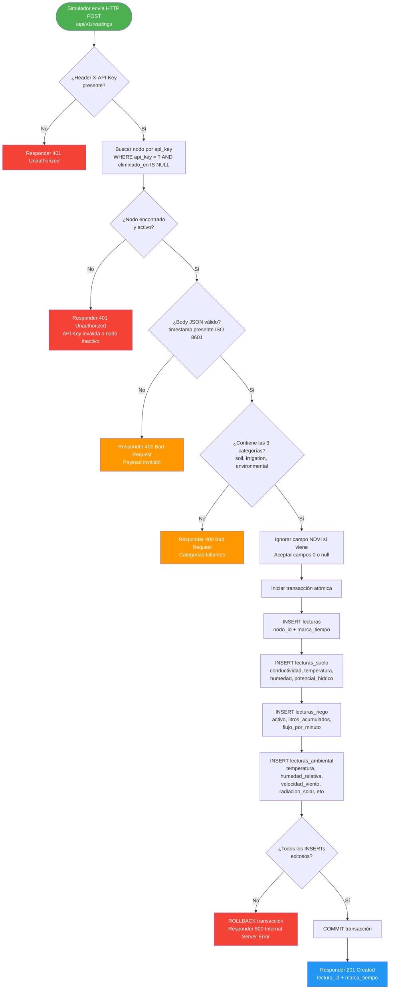
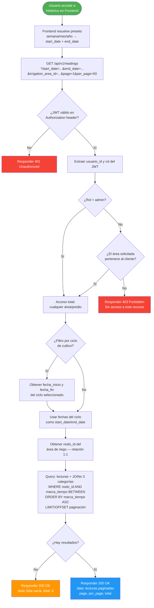
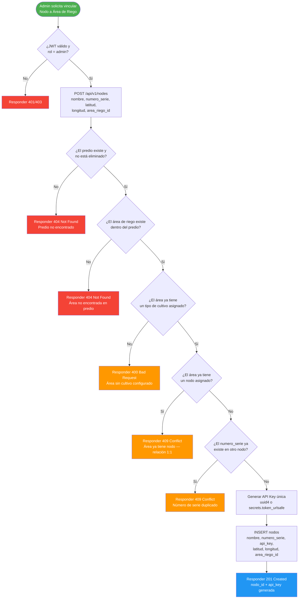
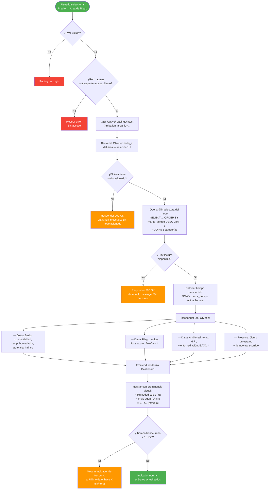
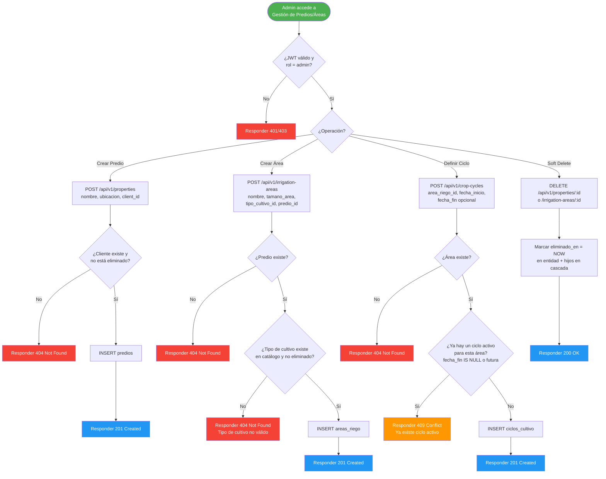
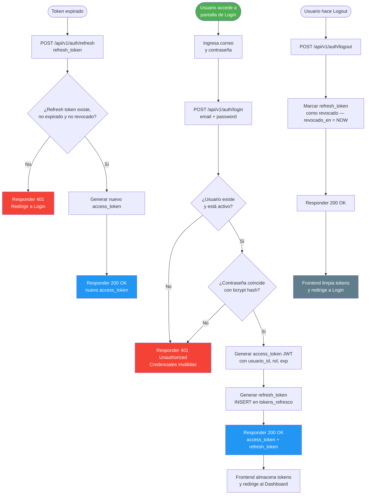
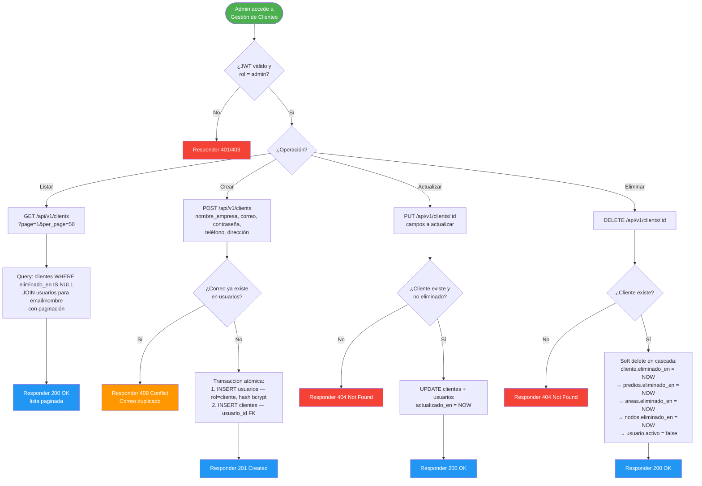
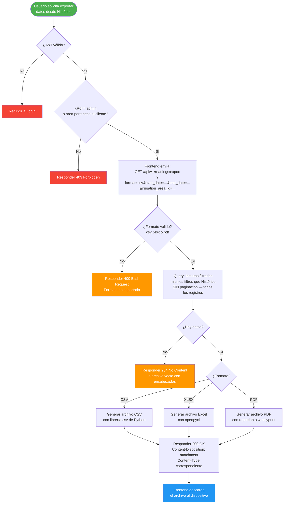
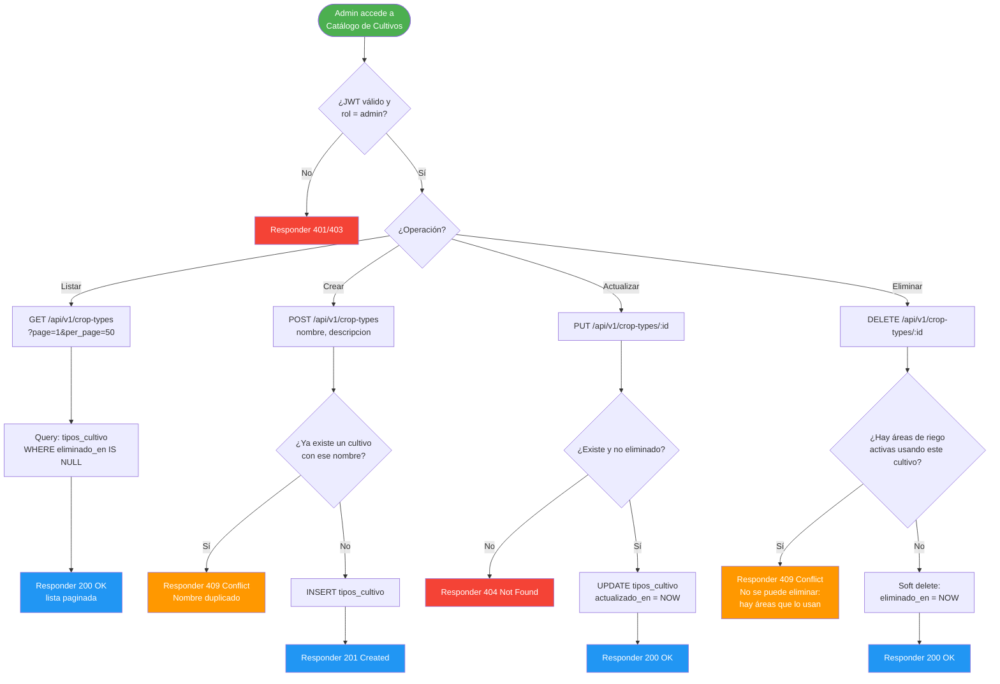

# ROL Y OBJETIVO
Actúa como un Arquitecto de Software Senior y experto en UML. Tu objetivo es ayudarme a diseñar los Diagramas de Actividad para un sistema web IoT de riego agrícola, basándote estrictamente en la arquitectura técnica y el plan de prioridades definido a continuación.

# 1. CONTEXTO TÉCNICO (MVP)
- **Infraestructura:** Servidor "Grogu" montado en una VPS Linux (8GB RAM).
- **Módulo de Control (Simulador):** Script en una PC local que envía peticiones HTTP POST cada **10 minutos** (144 lecturas/día por nodo) simulando el hardware físico. Cada petición envía un **payload JSON** con las **3 categorías dinámicas** de datos: Suelo (4 campos), Riego (3 campos: active, accumulated_liters, flow_per_minute), Ambiental (5 campos). **12 campos dinámicos** por lectura. Los datos "Generales" (Cultivo, Tamaño, GPS) son estáticos y NO van en el payload. Campos no disponibles se envían como `0` o `null`. NDVI está **excluido** del MVP. El nodo se autentica con API Key fija (`X-API-Key` header).
- **Backend (Puerto 5050):** Python/FastAPI. API REST que recibe los datos del simulador (POST a `/api/v1/readings`) y atiende las peticiones CRUD de la Web App. Auth: JWT para usuarios, API Key para nodos.
- **Base de Datos (Puerto 3306):** MySQL 8. Relacional. Jerarquía de entidades:
  - **Cliente** → **Predios** → **Áreas de Riego** → **Cultivo** (del catálogo administrable) → **Nodo IoT** (relación 1:1 con Área)
  - Catálogo administrable de cultivos: **Nogal, Alfalfa, Manzana, Maíz, Chile, Algodón** (valores iniciales, el Admin puede agregar/editar/eliminar).
  - Cada área puede tener **múltiples Ciclos de Cultivo** (historial de temporadas). Solo 1 activo a la vez.
  - Cada lectura lleva **timestamp** obligatorio (ISO 8601 UTC) para consultas por rango de fechas.
- **Frontend:** React (SPA). Dashboard multicategoría con datos prioritarios (Humedad de suelo, Flujo de agua, E.T.O.), indicador de frescura de datos, histórico con filtros (rango libre, semana/mes/año, ciclo de cultivo), y exportación (CSV/Excel/PDF).
- **Deployment:** Docker + Docker Compose. Contenedores: MySQL, Backend (FastAPI + Uvicorn), Frontend (Nginx).
- **Regla Estricta:** El MVP NO incluye Inteligencia Artificial, agentes autónomos ni n8n en su lógica central. La base de datos debe estar normalizada y tener trazabilidad para soportar estas funciones en una Fase 2.

# 2. PLAN DE DIAGRAMAS DE ACTIVIDAD
Nos enfocaremos primero en los flujos críticos (Esenciales) y dejaremos los flujos estándar (Genéricos) para el final o los simplificaremos.

**Esenciales (Prioridad Alta):**
1. **Transmitir Lectura de Sensor** — POST desde el simulador al Backend (`/api/v1/readings` con `X-API-Key` header). Validar payload: verificar presencia de las **3 categorías dinámicas** (soil, irrigation, environmental), aceptar valores `0`/`null` para campos no disponibles, verificar que el `timestamp` esté presente (ISO 8601), rechazar/ignorar NDVI si se envía. Riego tiene 3 campos (active bool, accumulated_liters, flow_per_minute). Guardar la lectura con todos sus campos en la BD.
2. **Consultar Histórico y Filtrar Datos** — GET desde Frontend al Backend. Validación de pertenencia (el Cliente solo ve sus predios/áreas). Soportar filtros por: rango libre de fechas, presets (semana/mes/año), ciclo de cultivo (inicio/fin). Incluir indicador de frescura (último timestamp + tiempo transcurrido) cuando no hay datos recientes.
3. **Vincular Nodo a Área de Riego** — Validar la cadena completa: Predio existe → Área existe dentro del predio → Cultivo asignado del catálogo → Nodo no está ya asignado a otra área (relación 1:1). Configurar datos estáticos del nodo: GPS (latitud/longitud) y tamaño del área.
4. **Visualizar Dashboard Multicategoría** — Flujo de carga del dashboard: obtener datos del nodo asignado al área seleccionada, mostrar las 3 categorías dinámicas con énfasis visual en datos prioritarios (Humedad de suelo, Flujo de agua, E.T.O.), manejar el caso de "sin datos" mostrando indicador de frescura (último timestamp + tiempo transcurrido sin actualización).
5. **Gestionar Predios y Áreas de Riego** — CRUD de predios (asignar a cliente) y áreas de riego dentro de predios (asignar cultivo del catálogo administrable, definir ciclo de cultivo con fecha inicio/fin).

**Genéricos (Prioridad Baja):**
- Autenticación (Login/Logout).
- Gestión de Clientes (CRUD estándar).
- Exportar Datos (Acción local en Frontend con datos previamente filtrados).

# 3. REGLAS DE RESPUESTA
Cuando te pida generar un diagrama de actividad, debes cumplir con lo siguiente:
- Utiliza **Mermaid.js** (`graph TD` o `stateDiagram-v2`) para que pueda visualizarlo directamente.
- Detalla la interacción entre los componentes técnicos (Simulador, Frontend, Backend, Base de Datos).
- Incluye validaciones lógicas importantes (ej. verificar si el nodo existe, si el usuario tiene permisos, si el área ya tiene un nodo asignado).
- Menciona los códigos de estado HTTP relevantes en las respuestas del Backend (ej. 200 OK, 400 Bad Request, 401 Unauthorized).
- En diagramas que involucren el payload del sensor, incluye la validación de campos: qué categorías se aceptan, cómo se manejan valores `0`/`null`, que NDVI se ignora/rechaza.
- En diagramas de visualización, incluye el manejo de "sin datos" con indicador de frescura (último timestamp + tiempo transcurrido).
- Espera a que yo te indique qué diagrama específico vamos a trabajar. No generes todos a la vez.

---

# 4. DIAGRAMAS DE ACTIVIDAD — ESENCIALES

## 4.1 Transmitir Lectura de Sensor

Flujo completo desde que el simulador envía un POST hasta que se almacena en BD.

---

## 4.2 Consultar Histórico y Filtrar Datos

Flujo desde que el usuario solicita datos históricos hasta que recibe la respuesta paginada.

---

## 4.3 Vincular Nodo a Área de Riego

Flujo de registro y vinculación de un nodo IoT a un área de riego (solo Admin).

---

## 4.4 Visualizar Dashboard Multicategoría

Flujo de carga del dashboard con datos prioritarios e indicador de frescura.

---

## 4.5 Gestionar Predios y Áreas de Riego

Flujo CRUD de predios y áreas de riego (solo Admin). Se muestra el flujo de creación que es el más complejo.

---

# 5. DIAGRAMAS DE ACTIVIDAD — GENÉRICOS

## 5.1 Autenticación (Login / Logout)

---

## 5.2 Gestión de Clientes (CRUD)

---

## 5.3 Exportar Datos Filtrados

---

## 5.4 Gestión del Catálogo de Tipos de Cultivo (CRUD Admin)

