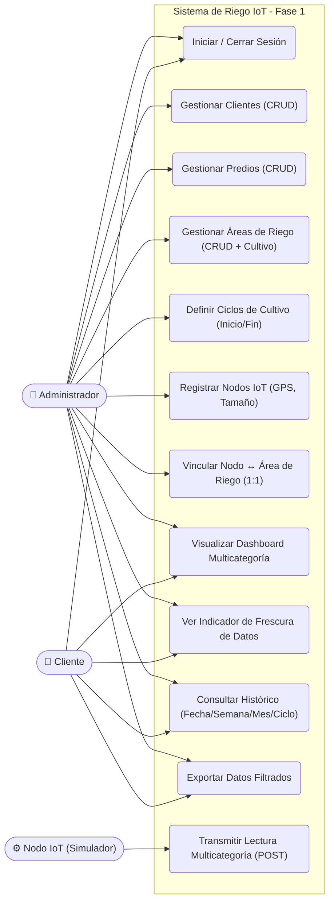

# ROL Y OBJETIVO
Actúa como un Arquitecto de Software Senior y experto en modelado UML. Tu objetivo es ayudarme a estructurar, analizar y expandir el Diagrama de Casos de Uso para la Fase 1 (MVP) de un sistema web IoT de monitoreo de riego agrícola.

# 1. LÍMITES DEL SISTEMA (Fase 1 - MVP)
- El sistema es una plataforma web cliente-servidor tradicional.
- **Fuera del alcance actual:** Inteligencia Artificial, agentes autónomos y flujos automatizados con n8n. Todo el modelado debe restringirse al flujo de datos transaccional básico (ingesta, gestión y visualización).
- El sistema central ("Servidor Grogu") alojará la base de datos y la API REST que orquesta la comunicación entre el hardware simulado y la interfaz web.
- **Jerarquía de entidades:** Cliente → Predios → Áreas de Riego → Cultivo (del catálogo fijo) → Nodo IoT (relación 1:1 entre Área y Nodo).

# 2. ACTORES DEL SISTEMA
Debes considerar estrictamente a los siguientes 3 actores interactuando con la plataforma:

1. **Administrador (Usuario Humano):** Tiene privilegios globales. Gestiona toda la plataforma:
   - CRUD de **Clientes** (agricultores/dueños de tierras).
   - CRUD de **Predios** (terrenos/propiedades) asignados a cada cliente.
   - CRUD de **Áreas de Riego** dentro de cada predio, asignando el tipo de cultivo del catálogo fijo: **Nogal, Alfalfa, Manzana, Maíz, Chile, Algodón**.
   - Definición de **Ciclos de Cultivo** (fecha inicio/fin) para cada área de riego.
   - Registro de **Nodos IoT** con datos estáticos (GPS latitud/longitud, tamaño) y vinculación 1:1 a un área de riego.
   - **Supervisión:** Puede ver el dashboard e histórico de cualquier cliente/predio/área.

2. **Cliente (Usuario Humano):** Es el agricultor o dueño de los predios (ej. cultivos de Nogal, Alfalfa). Tiene acceso restringido a sus propios predios y áreas de riego. Sus capacidades:
   - **Dashboard multicategoría:** Visualiza las 3 categorías dinámicas de sensores (Suelo, Riego, Ambiental) junto con los datos estáticos del área/nodo, con énfasis en datos prioritarios (Humedad de suelo, Flujo de agua, E.T.O.).
   - **Indicador de frescura:** Ve el último timestamp y tiempo transcurrido sin actualización por nodo/área.
   - **Navegación jerárquica:** Predio → Área de Riego → datos del sensor.
   - **Histórico con filtros:** Rango libre de fechas, presets (semana/mes/año), filtro por ciclo de cultivo.
   - **Exportar datos** filtrados.

3. **Nodo IoT / Módulo de Control (Sistema Externo):** Script simulador que envía un **payload JSON unificado** cada **10 minutos** (144 lecturas/día) con las **3 categorías dinámicas** de datos del sensor (Suelo, Riego, Ambiental). Los datos "Generales" (Cultivo, Tamaño) son estáticos y ya están en la BD, NO se envían. Campos no disponibles se envían como `0` o `null`. GPS no se incluye en el payload (es dato estático del nodo). Se autentica con API Key fija en el header `X-API-Key`.

# 3. DIAGRAMA BASE DE CASOS DE USO (PUNTO DE PARTIDA)
A continuación te proporciono el diagrama de casos de uso base en formato Mermaid. Tómalo como la estructura oficial sobre la cual construir o analizar cualquier requerimiento nuevo:

> **Notas del diagrama:**
> - El **Admin** tiene acceso a Dashboard e Histórico para supervisar cualquier cliente/predio.
> - El **Dashboard** muestra las 3 categorías dinámicas de sensores con prioridad visual en: Humedad de suelo, Flujo de agua, E.T.O.
> - El **Indicador de Frescura** muestra el último timestamp + tiempo transcurrido cuando un nodo deja de enviar datos.
> - **Histórico** soporta filtros por: rango libre de fechas, presets (semana/mes/año) y ciclo de cultivo (inicio/fin).
> - **Transmitir Lectura** envía un payload JSON con **3 categorías dinámicas**: Suelo (4 campos), Riego (3 campos: active, accumulated_liters, flow_per_minute), Ambiental (5 campos). **12 campos dinámicos** por lectura. Los datos "Generales" (Cultivo, Tamaño, GPS) son estáticos y NO van en el payload. Cada lectura lleva `timestamp` obligatorio. Campos no disponibles = `0` o `null`. NDVI excluido del MVP.
> - **Auth:** JWT para usuarios (Admin/Cliente), API Key fija (`X-API-Key` header) para nodos IoT.
> - **Stack:** Python/FastAPI (backend), React (frontend), MySQL 8 (BD), Docker Compose (deploy).
> - Catálogo fijo de cultivos: **Nogal, Alfalfa, Manzana, Maíz, Chile, Algodón**.
