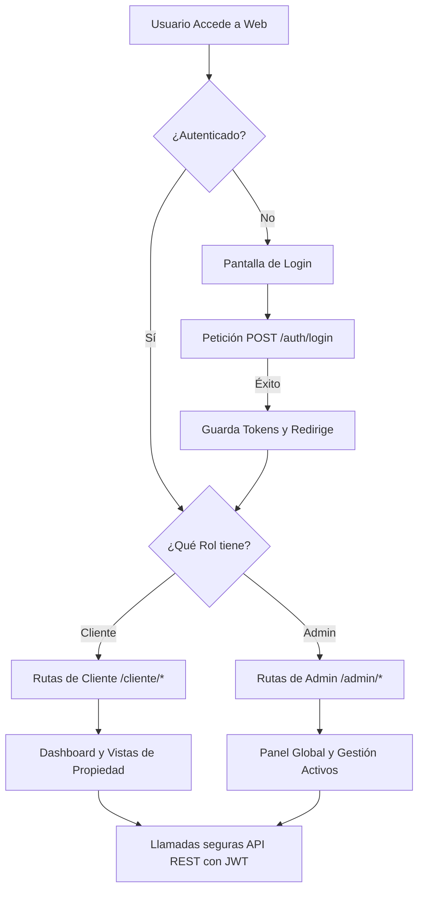
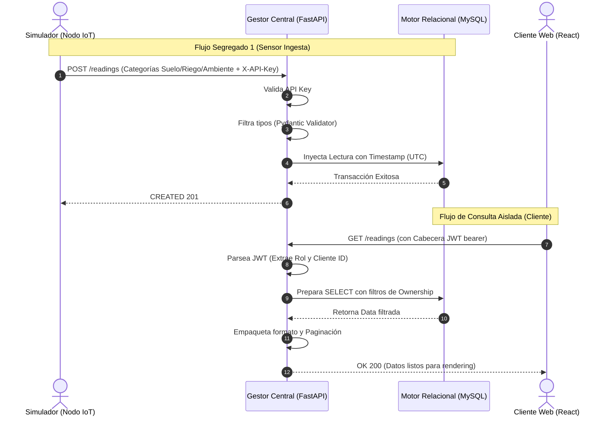

# Reporte Ejecutivo de Calidad y Flujos de Sistema (Fase 1)

Este documento certifica la validación de calidad y el funcionamiento íntegro de los flujos de información del sistema de Monitoreo de Sensores IoT Agrícolas (Fase MVP), presentado fundamentalmente para revisión de stakeholders e interesados técnicos y operativos. Abarca la cobertura total tanto del **Cerebro del Sistema (Backend)** como de la **Interfaz de Usuario (Frontend)**.

---

## A. Pruebas Estáticas y Manuales (Prevención de Errores)

Para garantizar que el sistema no presente fallas antes de llegar a producción, implementamos barreras de calidad estrictas en ambas capas:

### 1. En el Servidor (Backend API)
- **Estáticas (Validación Estricta de Datos):** La API (FastAPI) utiliza un filtro implacable (Pydantic) que asegura que si un sensor envía texto en lugar de números para la `Humedad`, o falta la `X-API-Key`, el sistema rechaza la carga automáticamente sin crashear.
- **Manuales (Panel Swagger UI):** Contamos con una consola interactiva de documentación técnica (`/docs`) donde el usuario administrador o un tester QA puede ejecutar peticiones manualmente (simular inicios de sesión, consultar listas de predios, inyectar lecturas) y ver las respuestas crudas en tiempo real.
* **Evidencia sugerida:**
> `[INSERTAR IMAGEN: Captura de pantalla de la interfaz interactiva "Swagger UI" (http://localhost:5050/docs) autorizando un token manualmente]`

### 2. En la Plataforma Web (Frontend)
- **Estáticas:** Análisis de compilación y tipado estricto (TypeScript) que verifica matemáticamente la integridad del código fuente antes de encender la interfaz.
- **Manuales:** Protocolo humano de QA validando responsividad móvil/escritorio, accesos de administrador vs. cliente, y la experiencia de usuario (UX) previniendo parpadeos de carga.

---

## B. Definición de las Pruebas Unitarias y de Integración (La Red de Seguridad)

Las pruebas automáticas ("robots evaluadores") revisan el código pieza por pieza en fragmentos de milisegundos.

### 1. El Motor de Servidor y Reglas de Negocio (Backend)
Contamos con una batería robusta de **más de 280 pruebas automáticas en Python (Pytest)** que se ejecutan en aproximadamente ~1 minuto. Todas evalúan el sistema en una base de datos temporal asilada (RAM) sin destruir los datos reales:
- **Unitarias (Lógica de Negocio):** Verifican en aislamiento total reglas estrictas como: *No permitir dos ciclos de cultivo activos al mismo tiempo*, asegurar que las contraseñas se encripten (bcrypt) irreversiblemente, y verificar el ciclo de vida seguro de los tokens JWT de sesión.
- **De Integración (API y Red):** 13 módulos completos que simulan a un cliente real HTTP llamando a las rutas de red. Evalúan escenarios complejos como: Iniciar sesión -> Recibir un Token -> Intentar crear un predio (o ser rechazado si no se tienen permisos) -> Guardar una lectura de sensor.

### 2. La Interfaz Visual (Frontend)
Componentes unitarios construidos con React Testing Library y Vitest. Evaluamos visualmente los botones, gráficas y "pantallas vacías" en un navegador virtual invisible, garantizando que un clic erróneo nunca rompa la paǵina.

* **Evidencia sugerida:**
> `[INSERTAR IMAGEN: Captura de pantalla de la terminal mostrando en letras verdes masivas "282 passed in 73.30s" ejecutando el comando de Pytest]`

---

## C. Secuencias de Flujo de Información Completadas

Certificamos que el "Viaje del Dato" desde el campo agrícola (simulado) hasta los ojos del cliente final está 100% operativo a través de pruebas End-to-End:

### Secuencia 1: Ingesta de Datos del Sensor (IoT → Backend Servidor)
1. El **Simulador de Nodo IoT** mide las 3 categorías dinámicas (Conductividad, Flujo de agua, etc.).
2. Pasa por el sistema de autenticación de Servidor con una credencial fija `X-API-Key`.
3. El **Gestor Central Backend** valida el formato, asocia la lectura automáticamente con el Predio/Cliente dueño de ese sensor, y resguarda el histórico en la base MySQL inyectando una marca de tiempo exacta.

### Secuencia 2: Intercambio Seguro y Visualización (Backend → Frontend Cliente)
1. El **Cliente** entra a la plataforma y proporciona su email/contraseña. El Backend le emite sus sellos JWT de acceso.
2. Al seleccionar "Área de Nogales", la Plataforma solicita los promedios al Backend.
3. El **Gestor Central** recupera la telemetría histórica del área asegurando que el rol coincida (protegiendo la privacidad de datos de otros ranchos).
4. El **Dashboard (React)** gráfica las fluctuaciones históricas y actualiza en tiempo real el "Indicador de Frescura" y la lectura más reciente en pantalla.

* **Evidencia sugerida (El entregable de mayor impacto):**
> `[INSERTAR ENLACE A VIDEO: Grabar la pantalla dividida. De un lado el script de Python Terminal enviando datos cada 10s al Backend (mostrando "HTTP 201 Created"). Del otro lado, el navegador con el dashboard del cliente. Se debe observar cómo al caer el registro en el servidor, los widgets web de Humedad y Evapotranspiración se re-ajustan instantáneamente.]`

---

# ANEXO 1: Flujos de Información del Frontend (React App)

Este documento describe los flujos funcionales actuales de navegacion y consumo de datos en la aplicacion frontend para los roles **Administrador** y **Cliente**.

### Diagrama del Flujo Visual y Navegación

---

## 1. Flujo Base (Comun)

### 1.1 Autenticacion y enrutamiento por rol
1. La ruta raiz (`/`) aterriza en Login para usuarios no autenticados.
2. El formulario envia credenciales al backend con `axios`.
3. El backend responde `access_token` + `refresh_token`; el frontend guarda estado en `AuthContext` y persistencia local.
4. `ProtectedRoute` valida sesion y rol para redirigir:
   - Cliente: layout y rutas bajo `/cliente`.
   - Admin: layout y rutas bajo `/admin`.

### 1.2 Comportamiento transversal
- La app mantiene polling en vistas clave (dashboard/alertas) con guardas de concurrencia.
- El polling se pausa cuando la pestana esta inactiva (`usePageVisibility`).
- Las vistas de mapa se cargan en modo lazy (`Suspense`) y usan prefetch condicional desde navegacion para reducir tiempo de primera entrada.

---

## 2. Flujo de Cliente

El cliente consume informacion de sus propios recursos bajo ownership (predios, areas, nodos y lecturas).

### 2.1 Inicio y contexto operativo
- **Dashboard (`/cliente`)**: resumen de metricas prioritarias (humedad, flujo, ETO), estado por umbrales y frescura de datos.
- **Predios (`/cliente/areas`)**: seleccion de predio/area para fijar contexto.
- **Detalle de predio (`/cliente/predio/:predioId`)**: profundizacion por predio.

### 2.2 Geoespacial
- **Mapa cliente (`/cliente/mapa`)**:
  - Render de nodos por ownership con `GET /api/v1/nodes/geo`.
  - Filtros por predio y area.
  - Panel de detalle de nodo.
  - Leyenda persistente por estado y listado de nodos sin GPS.

### 2.3 Historico y exportacion
- **Historico (`/cliente/historico`)**: series por rango de fechas, filtros y consulta de disponibilidad.
- **Exportacion (`/cliente/exportar`)**: descarga de CSV/XLSX/PDF con filtros activos.

### 2.4 Operacion de alertas y configuracion
- **Alertas (`/cliente/alertas`)**: listado, filtros y marcado de leidas.
- **Umbrales (`/cliente/umbrales`)**: gestion de umbrales dentro de su ownership.
- **Notificaciones (`/cliente/notificaciones`)**: preferencias por area/severidad/canal y switch global.
- **Perfil (`/cliente/perfil`)**: gestion de datos de cuenta.

---

## 3. Flujo de Administrador

El admin tiene visibilidad global y CRUD de estructura operativa.

### 3.1 Supervision
- **Dashboard (`/admin`)**: vista agregada de clientes, nodos, lecturas y estado operacional.

### 3.2 Geoespacial global
- **Mapa admin (`/admin/mapa`)**:
  - Consulta global con filtros jerarquicos `cliente -> predio -> area`.
  - Modo de visualizacion por marcadores o clusters.
  - Capas por estado de frescura y leyenda con conteos.
  - Soporte para nodos sin GPS.

### 3.3 Gestion de jerarquia agricola
- **Clientes (`/admin/clientes`)**
- **Predios por cliente (`/admin/clientes/:clientId/predios`)**
- **Areas por predio (`/admin/predios/:predioId/areas`)**
- **Catalogo de cultivos (`/admin/cultivos`)**
- **Ciclos de cultivo (`/admin/ciclos`)**
- **Nodos (`/admin/nodos`, `/admin/nodos/:nodeId`)**

### 3.4 Gobierno operativo
- **Alertas (`/admin/alertas`)**
- **Umbrales (`/admin/umbrales`)**
- **Auditoria (`/admin/auditoria`)**

---

## 4. Flujo de datos frontend-backend

1. El frontend consume API versionada `/api/v1/*` usando la instancia `api` de Axios.
2. JWT se envia en `Authorization: Bearer <token>` para usuarios.
3. Consultas geoespaciales usan `GET /api/v1/nodes/geo` con filtros de ownership y jerarquia.
4. La API responde con payload tipado y paginacion en listados.

  

# ANEXO 2: Flujos de Información del Backend (FastAPI)

Este documento describe los procesos transaccionales, de seguridad y de persistencia de datos que ocurren en el servidor ("Cerebro" del sistema) para soportar la Fase MVP del sistema de monitoreo IoT.

### Diagrama del Flujo de Datos Transaccional (IoT -> Servidor -> Cliente)

---

## 1. Flujo de Ingesta IoT (El Camino del Sensor)

Es el flujo más crítico y de mayor volumen. Permite que las lecturas del hardware lleguen a la base de datos de manera normalizada y segura.

1. **Emisión:** El Módulo de Control (o Simulador) realiza una petición `POST /api/v1/readings`.
2. **Seguridad (Middleware):** El backend intercepta la petición y busca el header `X-API-Key`.
   - Si no existe o es inválido $\rightarrow$ HTTP 401 Unauthorized.
   - Si es válido, se relaciona inmediatamente con el `Nodo IoT` y el `Área de Riego` correspondiente en la base de datos.
3. **Validación Estricta (Pydantic):** El cuerpo JSON se filtra matemáticamente. Se espera la estructura de las **3 categorías dinámicas** (Suelo, Riego, Ambiental). Si faltan campos prioritarios, o los campos numéricos vienen como texto, la petición se rechaza con un HTTP 422.
4. **Persistencia:** Si todo es correcto, SQLAlchemy inyecta la lectura en MySQL añadiendo la marca de tiempo exacta (`timestamp`) y finaliza la transacción.
5. **Respuesta:** Se devuelve un `HTTP 201 Created` al nodo.

---

## 2. Flujo de Autenticación y Control de Acceso (Usuarios)

Garantiza que la información agrícola de un cliente sea completamente invisible para otros clientes.

1. **Login:** El cliente/admin envía sus credenciales a `POST /api/v1/auth/login`.
2. **Verificación:** El sistema compara el hash seguro `bcrypt`.
3. **Emisión de Tokens:** Se generan firmas JWT (JSON Web Tokens). Un token de corta duración (`access_token`) y uno de larga duración (`refresh_token`).
4. **Barrera de Propiedad (Ownership):**
   - En cualquier petición GET/POST a la API (ej. `/api/v1/properties`), la capa de seguridad extrae el rol y el ID del token JWT.
   - Si el rol es `cliente`, internamente inyecta cláusulas SQL (ej. `WHERE cliente_id = X`) en todas las consultas para evitar escapes de información (Data Leak).
   - Si el rol es `admin`, se le permite el acceso global.

---

## 3. Flujo de Consulta de Lecturas (Dashboard en Tiempo Real)

Cómo el backend procesa las solicitudes de la aplicación web y devuelve datos agregados.

1. **Solicitud de Históricos:** El Frontend dispara `GET /api/v1/readings` con filtros como `start_date`, `end_date`, `irrigation_area_id` o `crop_cycle_id`.
2. **Filtro Transaccional:** El servicio lee todos los registros y ensambla los promedios e indicadores de frescura (último timestamp).
3. **Paginación Embebida:** Para evitar sobrecargas de red al consultar miles de filas, el backend empaqueta los resultados en una estructura JSON paginada (ítems, total, página actual).

---

## 4. Flujo de Exportación de Datos

Permite al usuario extraer su telemetría fuera de la plataforma.

1. **Petición Tipificada:** Se recibe `GET /api/v1/readings/export?format=csv` (o `excel`, `pdf`).
2. **Acopio de Datos:** El servidor aplica exactamente los mismos filtros de ownership que en el Listado Normal.
3. **Renderizado en Memoria:**
   - Transforma los diccionarios SQLAlchemy a una representación tabular en buffers de memoria temporal (StringIO / BytesIO).
4. **Descarga Directa:** FastAPI retorna una `StreamingResponse` con las cabeceras MIME correctas (ej. `text/csv`) forzando la descarga inmediata del archivo en el navegador del usuario en lugar de mostrar texto crudo.

---

## 5. Flujos de Gestión (CRUD de Administrador)

El administrador interactúa con la estructura relacional a través del sistema de enrutamiento agrupado.

1. **Asignaciones Jerárquicas:** Creación encadenada de: `Clientes` $\rightarrow$ `Predios` $\rightarrow$ `Áreas de Riego` $\rightarrow$ `Ciclos de Cultivo` y `Nodos IoT` (relación 1:1 a un área).
2. **Gestión de Catálogos:** Operaciones estándar REST para administrar el catálogo global de Tipos de Cultivo (Nogal, Maíz, etc.).
3. **Borrados Suaves (Soft Delete):** Ninguna entidad crítica se elimina físicamente con sentencias `DROP` o `DELETE`. Se utiliza el campo `eliminado_en` (Timestamp). Cualquier registro con este campo deja de aparecer en los Endpoints de listado, manteniendo la integridad referencial intacta.
