# Arquitectura del Sistema — IoT Riego Agrícola

> Documento de referencia visual de la arquitectura técnica del sistema.
> Contiene los diagramas de infraestructura, flujos de datos y autenticación para el **MVP (Fase 1)**, y un apéndice pre-redactado con la **expansión de Fase 2** listo para activar.

---

## Tabla de Contenidos

- [1. Diagrama de Arquitectura General (MVP)](#1-diagrama-de-arquitectura-general-mvp)
- [2. Flujo de Datos del Sensor](#2-flujo-de-datos-del-sensor)
- [3. Flujos de Autenticación](#3-flujos-de-autenticación)
- [4. Jerarquía de Entidades](#4-jerarquía-de-entidades)
- [5. Stack Tecnológico](#5-stack-tecnológico)
- [6. FASE 2 — Expansión de Arquitectura (pre-redactada)](#6-fase-2--expansión-de-arquitectura-pre-redactada)

---

## 1. Diagrama de Arquitectura General (MVP)

Este diagrama muestra **todos los componentes del sistema y cómo se comunican entre sí** en producción.

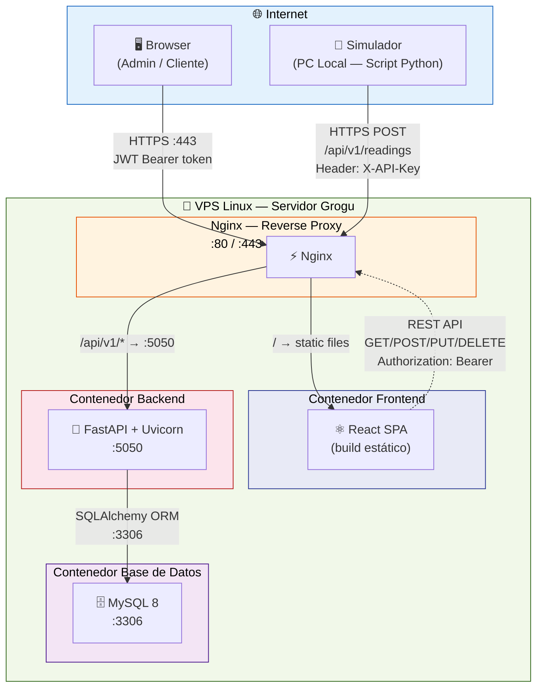

**Resumen de puertos y protocolos:**

| Origen | Destino | Puerto | Protocolo / Ruta |
|--------|---------|--------|------------------|
| Browser | Nginx | 80 → 443 | HTTPS (redirect HTTP→HTTPS) |
| Simulador | Nginx | 443 | HTTPS POST `/api/v1/readings` |
| Nginx | Frontend | interno | `/` → archivos estáticos React |
| Nginx | Backend | 5050 | `/api/v1/*` → proxy pass |
| Backend | MySQL | 3306 | SQLAlchemy (conexión interna Docker) |

> **Nota:** El Frontend no se comunica directamente con el Backend. Toda petición pasa por Nginx, que actúa como reverse proxy.

---

## 2. Flujo de Datos del Sensor

Cómo viaja una lectura desde el simulador hasta la base de datos (cada 10 minutos por nodo).

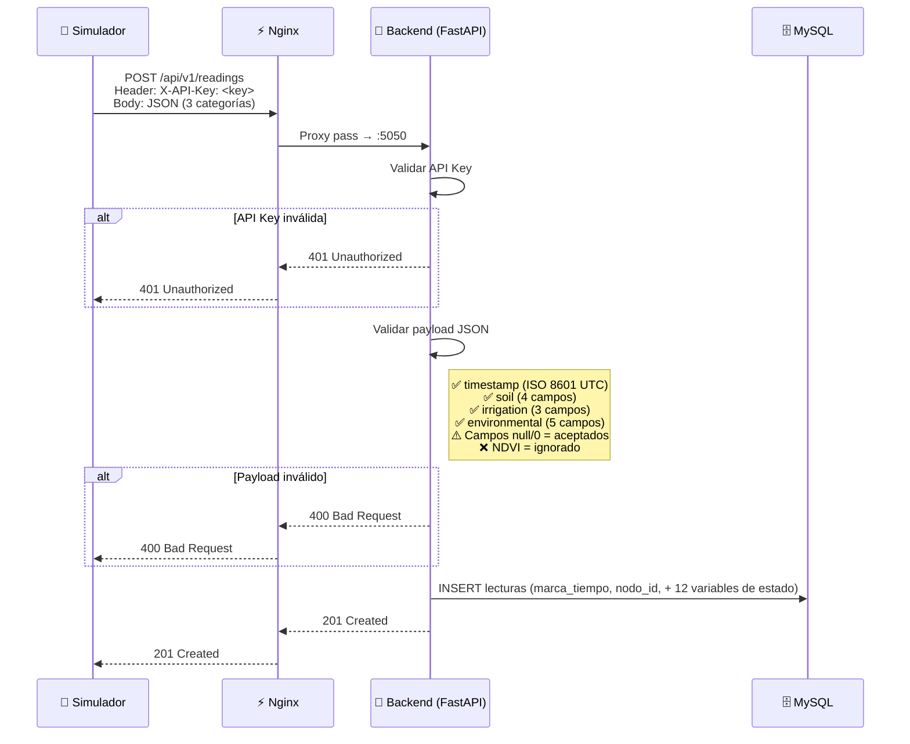

**Payload JSON enviado por el simulador:**

```json
{
  "timestamp": "2026-02-24T14:30:00Z",
  "soil": {
    "conductivity": 2.5,
    "temperature": 22.3,
    "humidity": 45.6,
    "water_potential": -0.8
  },
  "irrigation": {
    "active": true,
    "accumulated_liters": 1250.0,
    "flow_per_minute": 8.3
  },
  "environmental": {
    "temperature": 28.1,
    "relative_humidity": 55.0,
    "wind_speed": 12.5,
    "solar_radiation": 650.0,
    "eto": 5.2
  }
}
```

> Campos no disponibles se envían como `0` o `null`. El `timestamp` es obligatorio. Datos estáticos (GPS, cultivo, tamaño) **no** van en el payload.

---

## 3. Flujos de Autenticación

El sistema maneja **dos mecanismos de autenticación distintos**: uno para usuarios humanos y otro para nodos IoT.

### 3.1 Usuarios (Admin / Cliente) — JWT

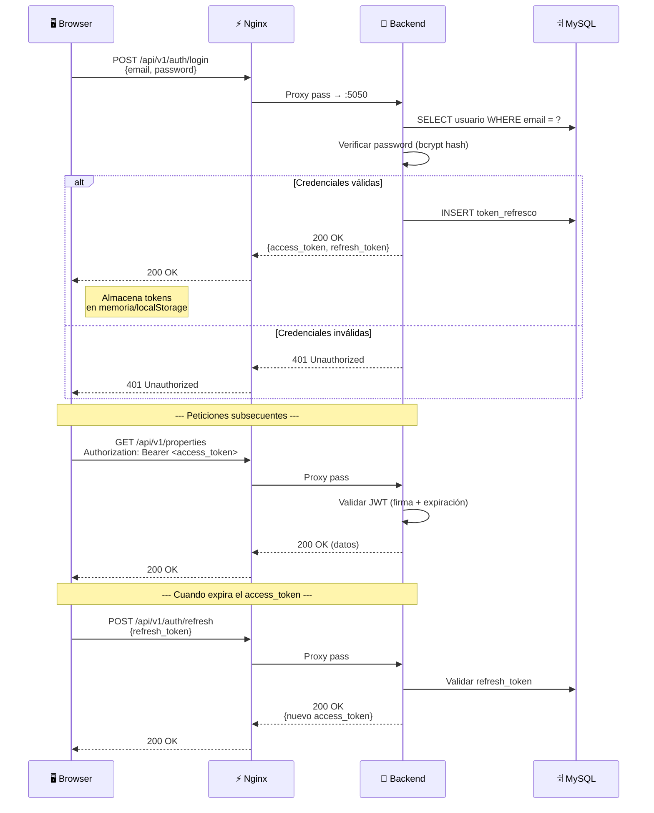

### 3.2 Nodos IoT — API Key

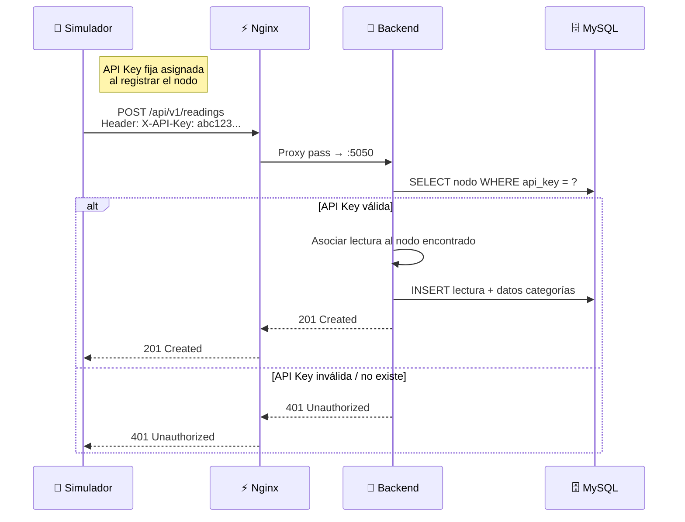

**Comparativa rápida:**

| Aspecto | Usuarios (JWT) | Nodos IoT (API Key) |
|---------|---------------|---------------------|
| Header | `Authorization: Bearer <token>` | `X-API-Key: <key>` |
| Expiración | Access token expira (minutos), refresh renueva | No expira (key fija) |
| Flujo | Login → obtener tokens → enviar Bearer | Key asignada al registro → enviar siempre |
| Permisos | CRUD completo según rol (Admin/Cliente) | Solo POST `/api/v1/readings` (escritura) |

---

## 4. Jerarquía de Entidades

Cómo se organizan los datos del sistema de arriba hacia abajo. Esta jerarquía **define los permisos**: un Cliente solo ve lo que cuelga debajo de él.

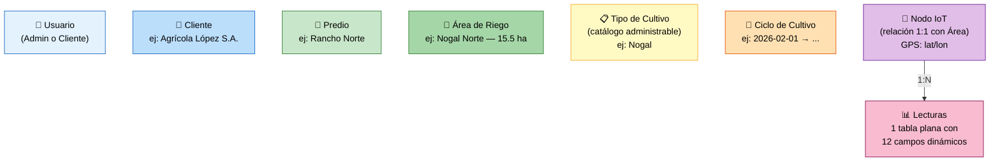

**Reglas clave:**
- El **Admin** puede ver y gestionar todo (CRUD completo).
- El **Cliente** solo ve sus propios predios, áreas y lecturas.
- Cada Área de Riego tiene **exactamente 1 Nodo** (relación 1:1).
- Cada Área puede tener **múltiples Ciclos de Cultivo** (historial de temporadas), pero solo **1 activo** a la vez.
- El **catálogo de tipos de cultivo** es administrable por el Admin. Valores iniciales: Nogal, Alfalfa, Manzana, Maíz, Chile, Algodón.

---

## 5. Stack Tecnológico

| Capa | Tecnología | Rol |
|------|-----------|-----|
| **Frontend** | React (SPA) | Interfaz web. Build estático servido por Nginx. Dashboard, histórico, exportación. |
| **Backend** | Python 3.11+ / FastAPI / Uvicorn | API REST. Recibe lecturas de sensores + atiende CRUD del frontend. Async. |
| **Base de Datos** | MySQL 8 | Almacenamiento relacional. 12 tablas. ORM: SQLAlchemy. Migraciones: Alembic. |
| **Reverse Proxy** | Nginx | Punto de entrada público. SSL termination. Rutea `/` → frontend, `/api/v1/*` → backend. |
| **Contenedores** | Docker + Docker Compose | Orquestación de 3 contenedores (Frontend+Nginx, Backend, MySQL) en la VPS. |
| **Servidor** | VPS Linux ("Servidor Grogu") | Infraestructura. Puertos expuestos: 80, 443. Internos: 5050, 3306. |

**Convenciones del API:**
- URLs en **inglés**, plural, versionadas: `/api/v1/clients`, `/api/v1/properties`, `/api/v1/readings`
- Paginación obligatoria en listados: `?page=1&per_page=50`
- Filtros de fecha: `?start_date=2026-01-01&end_date=2026-01-31`
- Exportación: `GET /api/v1/readings/export?format=csv|xlsx|pdf`

---
---

## 6. FASE 2 — Expansión de Arquitectura (pre-redactada)

> ⏳ **ESTA SECCIÓN NO ESTÁ IMPLEMENTADA.** Está pre-redactada para que, al iniciar la Fase 2, solo haya que activar los componentes — no redactar desde cero. Cada sub-sección incluye el diagrama, las tablas y los endpoints listos para integrar.

---

### 6.1 Diagrama de Arquitectura Expandida (Fase 2)

El diagrama del MVP con todos los componentes nuevos añadidos. **Cuando se active la Fase 2, este diagrama reemplaza al de la Sección 1.**

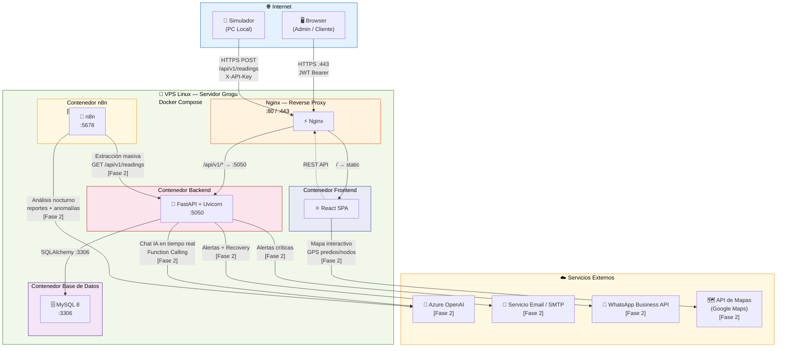

---

### 6.2 Nuevas Tablas de Base de Datos

Tablas que se agregan en Fase 2. Se conectan a las tablas existentes del MVP.

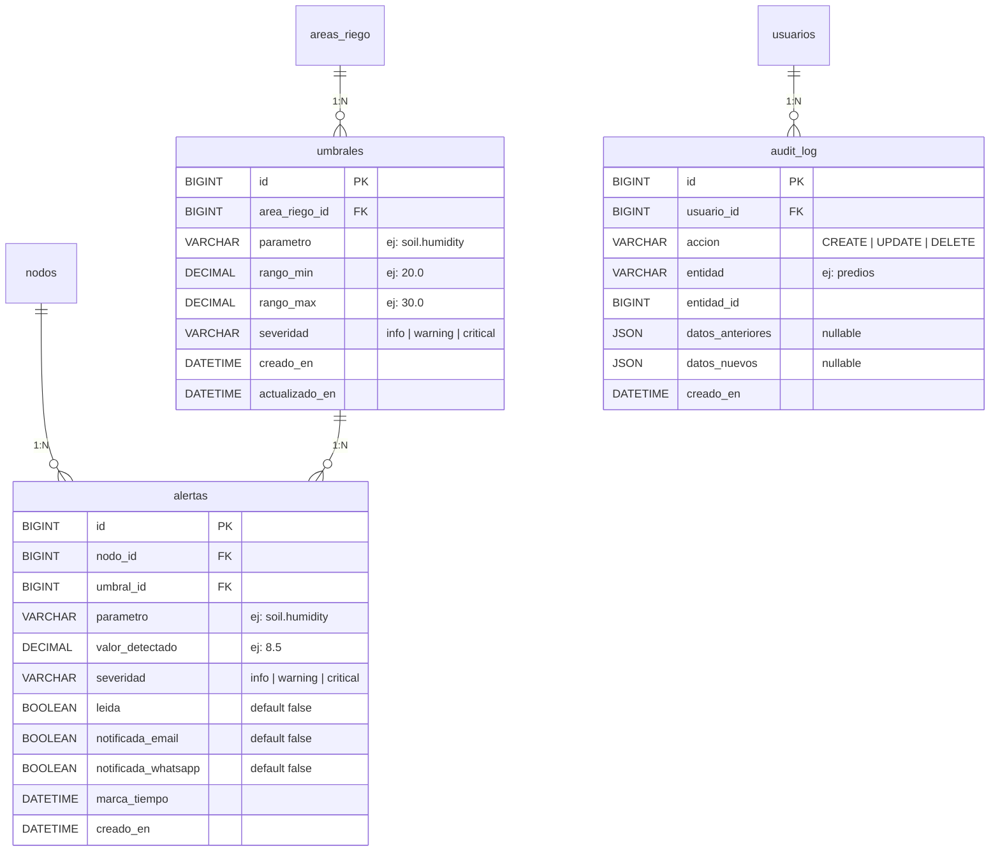

**Migraciones Alembic necesarias:**
- `alembic revision --autogenerate -m "add_umbrales_table"`
- `alembic revision --autogenerate -m "add_alertas_table"`
- `alembic revision --autogenerate -m "add_audit_log_table"`
- (Opcional) `alembic revision -m "add_ndvi_field"` — si se define la fuente de datos.

---

### 6.3 Nuevos Endpoints de API

| Módulo | Método | Endpoint | Descripción |
|--------|--------|----------|-------------|
| **Umbrales** | GET | `/api/v1/thresholds?irrigation_area_id=` | Listar umbrales de un área |
| | POST | `/api/v1/thresholds` | Crear umbral |
| | PUT | `/api/v1/thresholds/{id}` | Editar umbral |
| | DELETE | `/api/v1/thresholds/{id}` | Eliminar umbral |
| **Alertas** | GET | `/api/v1/alerts?node_id=&severity=&read=` | Listar alertas con filtros |
| | GET | `/api/v1/alerts/{id}` | Detalle de alerta |
| | PATCH | `/api/v1/alerts/{id}/read` | Marcar alerta como leída |
| **Auditoría** | GET | `/api/v1/audit-logs?user_id=&entity=&start_date=&end_date=` | Listar logs (solo Admin) |
| **Chat IA** | POST | `/api/v1/chat` | Enviar pregunta → respuesta IA |
| **Recuperación** | POST | `/api/v1/auth/forgot-password` | Solicitar email de recuperación |
| | POST | `/api/v1/auth/reset-password` | Resetear contraseña con token |

---

### 6.4 Flujo de Alertas por Umbrales

Cuando llega una lectura, el backend compara los valores contra los umbrales configurados y genera alertas si están fuera de rango.

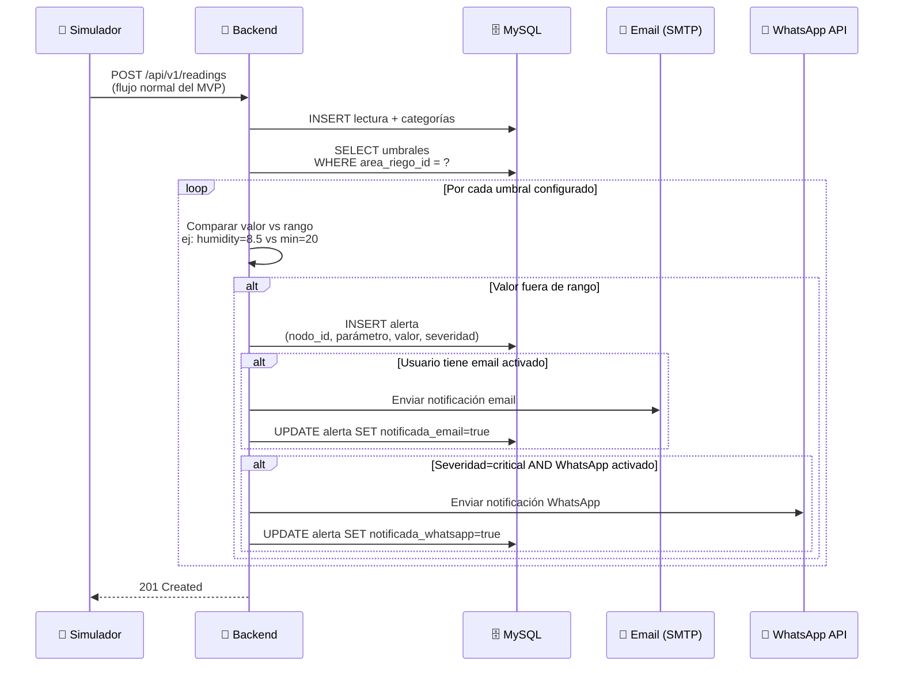

---

### 6.5 Flujos de Inteligencia Artificial

#### A) Chat Interactivo en Tiempo Real

El usuario hace una pregunta en lenguaje natural y la IA responde usando datos del sistema.

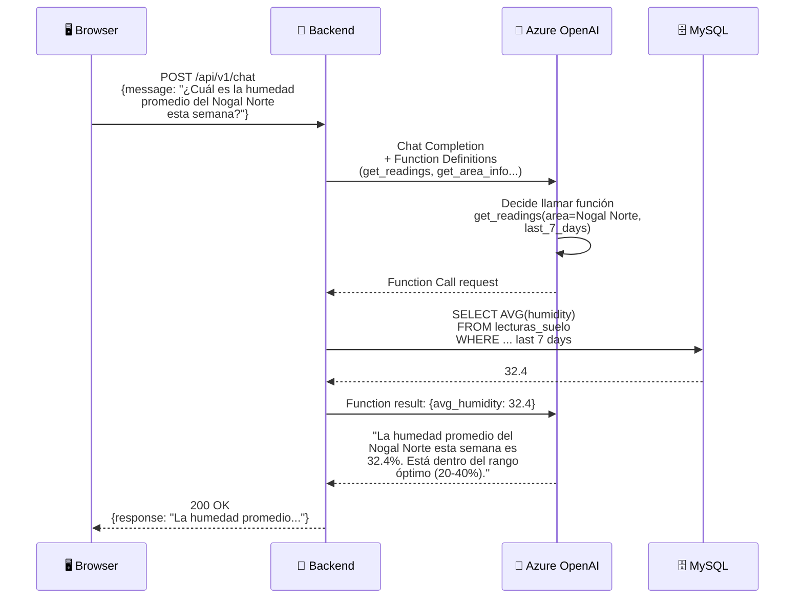

#### B) Análisis Nocturno Automatizado (n8n)

Tareas programadas que extraen datos masivos, los analizan con IA, y generan reportes o alertas tempranas.

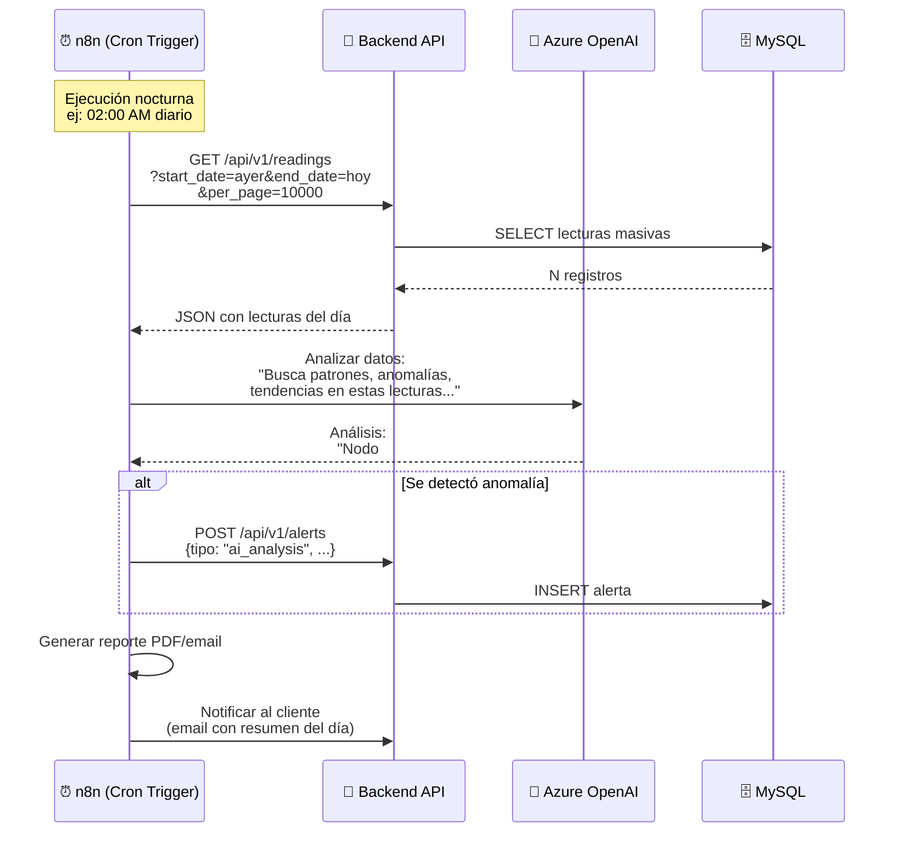

---

### 6.6 Flujo de Inactividad de Nodo (Alerta Activa)

En el MVP, la "frescura de datos" es un indicador pasivo en el frontend. En Fase 2, el backend genera una alerta activa.

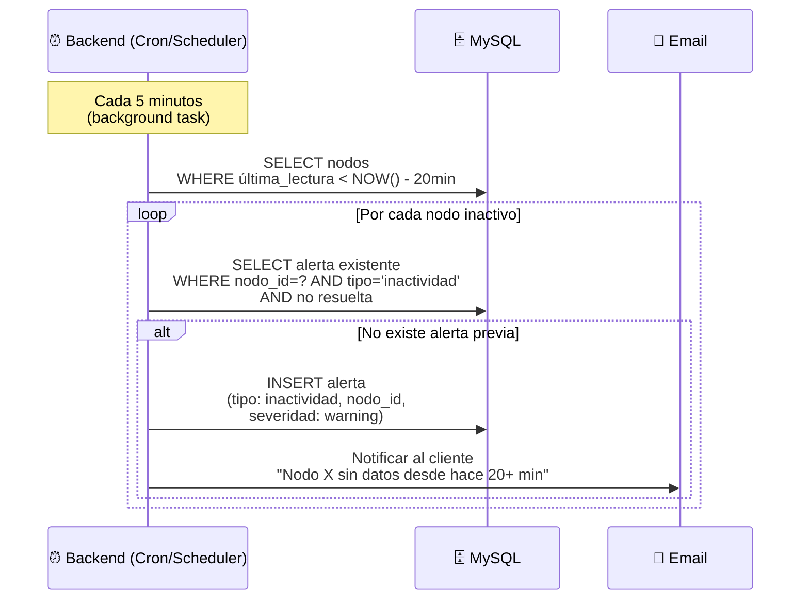

---

### 6.7 Checklist de Activación — Fase 2

Pasos concretos para integrar cada módulo. Marcar conforme se vayan completando.

#### Infraestructura
- [ ] Agregar contenedor **n8n** al `docker-compose.yml` (puerto 5678, volumen para workflows)
- [ ] Configurar **Azure OpenAI** (API key, endpoint, modelo en variables de entorno)
- [ ] Configurar **servicio SMTP** (host, puerto, credenciales en variables de entorno)
- [ ] Configurar **WhatsApp Business API** (token, número, en variables de entorno)
- [ ] Agregar **Google Maps API key** al frontend (variable de entorno del build)

#### Base de Datos
- [ ] Ejecutar migración Alembic: tabla `umbrales`
- [ ] Ejecutar migración Alembic: tabla `alertas`
- [ ] Ejecutar migración Alembic: tabla `audit_log`
- [ ] (Opcional) Migración para campo NDVI si se define la fuente de datos

#### Backend — Endpoints
- [ ] Implementar CRUD `/api/v1/thresholds` (umbrales por área)
- [ ] Implementar `/api/v1/alerts` (listado, detalle, marcar como leída)
- [ ] Implementar `/api/v1/audit-logs` (solo Admin)
- [ ] Implementar `/api/v1/chat` (proxy a Azure OpenAI con Function Calling)
- [ ] Implementar `/api/v1/auth/forgot-password` y `/api/v1/auth/reset-password`
- [ ] Agregar lógica de comparación lectura vs umbrales al flujo de ingesta (POST readings)
- [ ] Agregar background task para detección de nodos inactivos (≥20 min sin datos)
- [ ] Integrar envío de email (alertas + recuperación de contraseña)
- [ ] Integrar envío de WhatsApp (alertas críticas)
- [ ] Agregar middleware de auditoría (log de acciones CRUD al `audit_log`)

#### Frontend
- [ ] Componente de chat IA (interfaz conversacional)
- [ ] Vista de alertas (listado, filtros, marcar como leída)
- [ ] Configuración de umbrales por área (formulario)
- [ ] Visualización geoespacial con Google Maps (mapa de predios/nodos)
- [ ] Flujo de "Olvidé mi contraseña" (formulario + pantalla de reset)
- [ ] Indicadores de color por umbrales en dashboard (verde/amarillo/rojo)
- [ ] Vista de auditoría para Admin

#### Documentación
- [ ] Actualizar diagrama de arquitectura: reemplazar Sección 1 con diagrama de Sección 6.1
- [ ] Actualizar SRS: reincorporar REQs de Fase 2 como activos
- [ ] Actualizar casos de uso: nuevos flujos de alertas, umbrales, chat IA
- [ ] Actualizar diagramas de actividad: agregar flujos de alertas, IA, recuperación de contraseña
- [ ] Eliminar esta sección (6) o marcarla como "✅ ACTIVADA"
