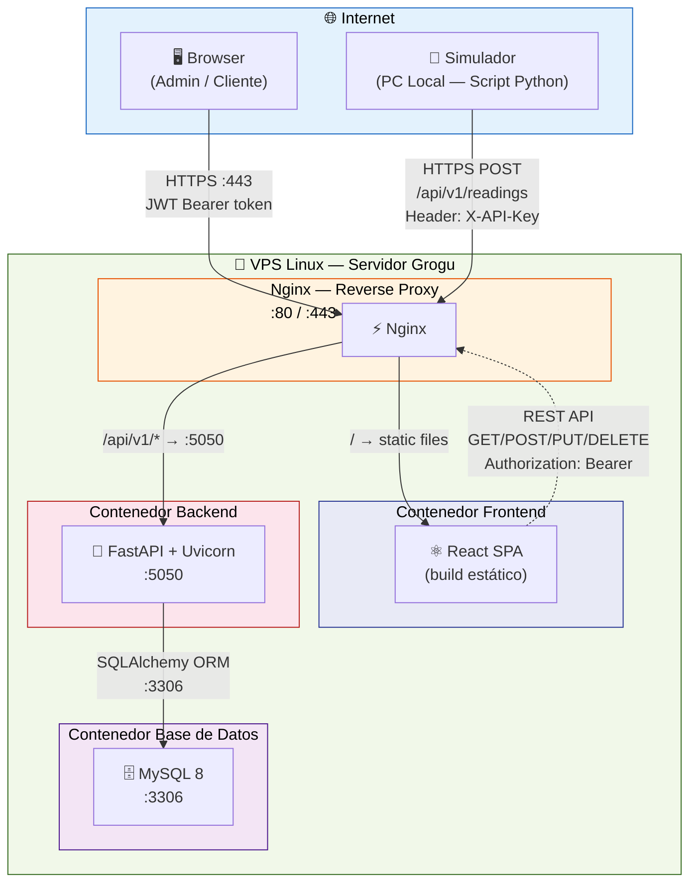
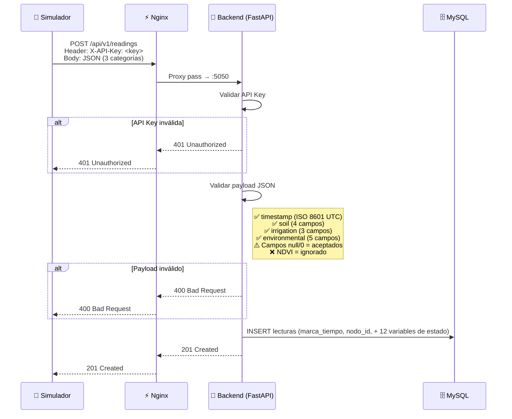
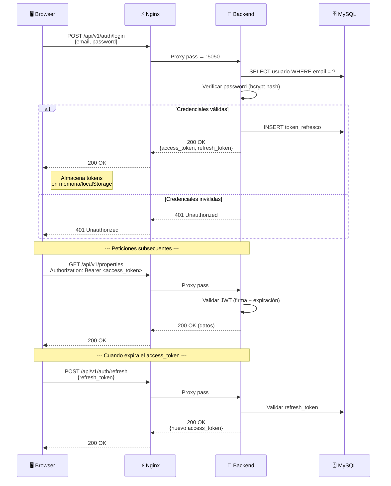
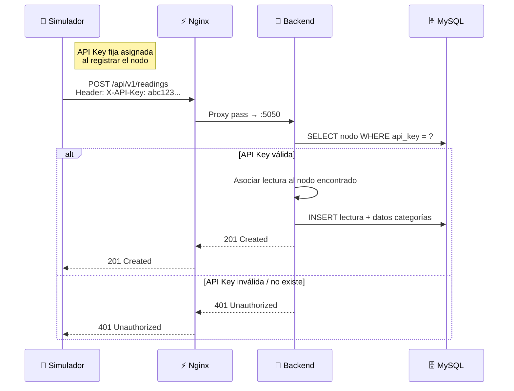
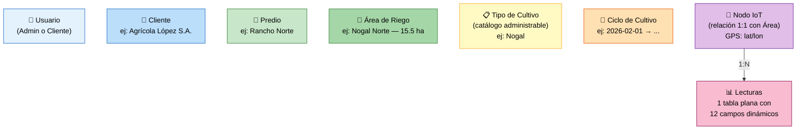
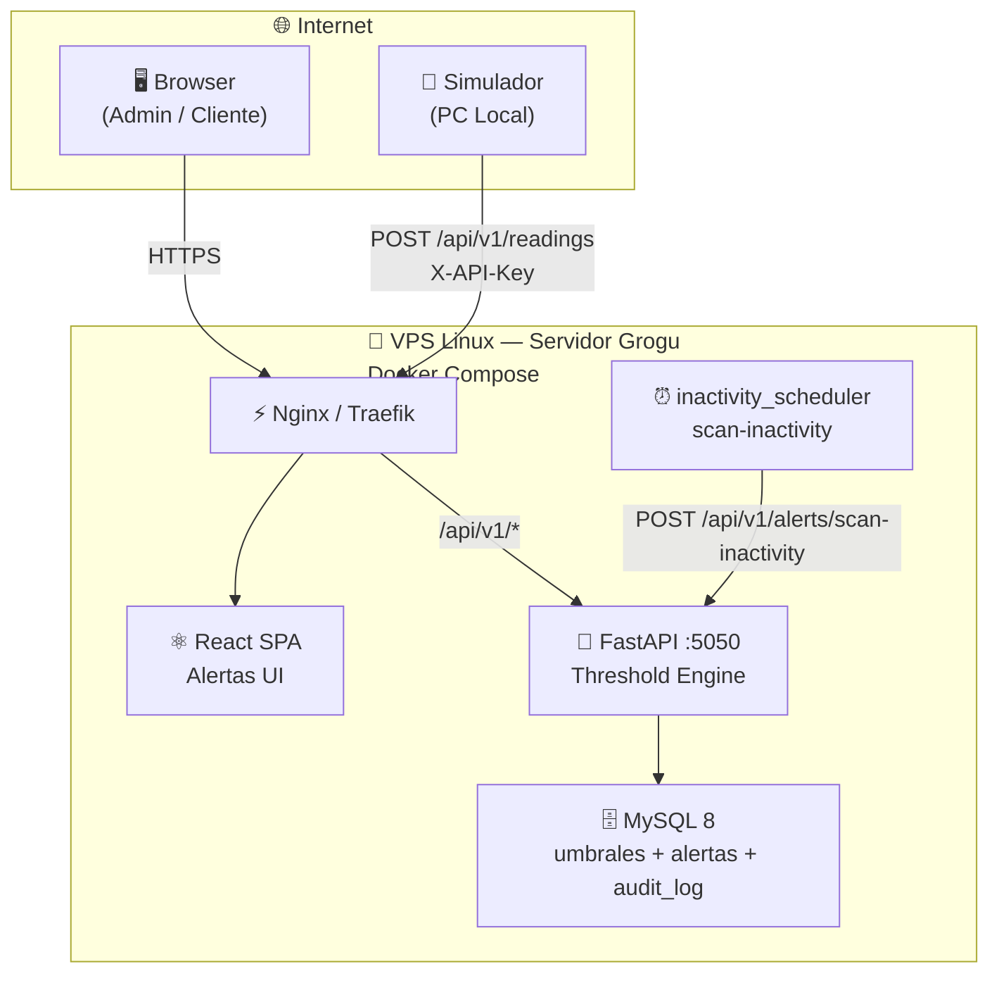
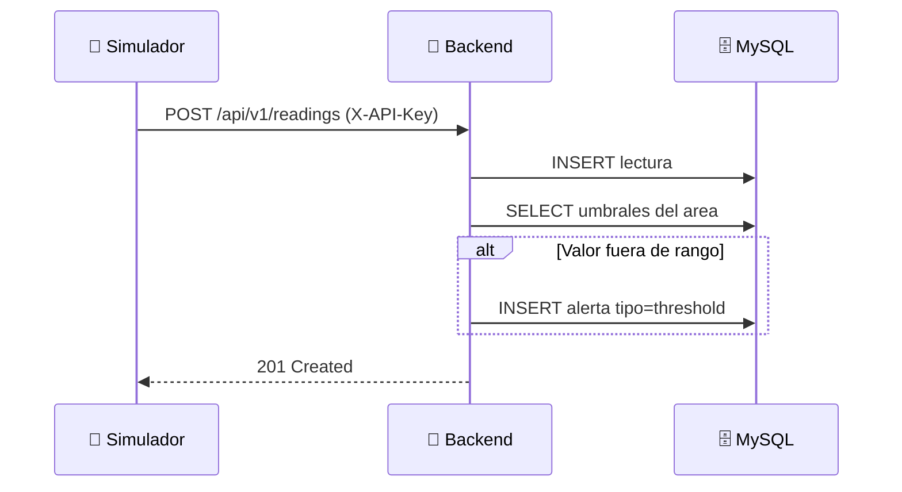
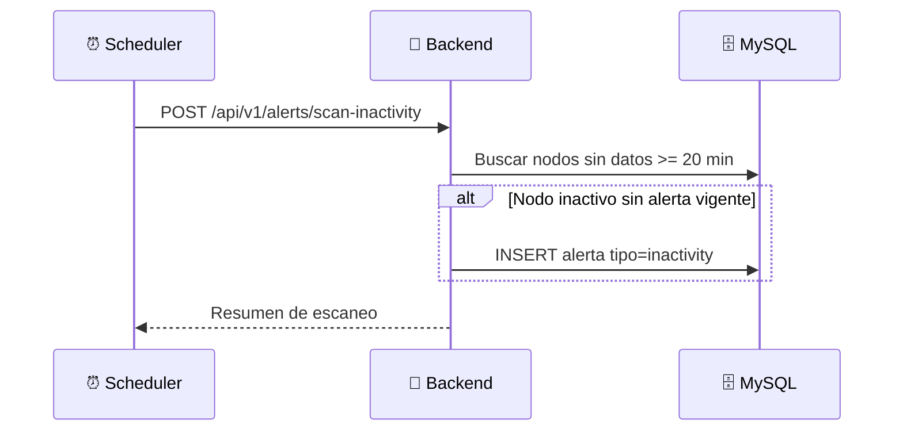

# Arquitectura del Sistema — IoT Riego Agrícola

> Documento de referencia visual de la arquitectura técnica del sistema.
> Contiene los diagramas de infraestructura, flujos de datos y autenticación para el **MVP (Fase 1)**, el estado activo de **MVP Extendido (Fase 2 Lite)** y el alcance futuro de **Fase 2 Completa**.

---

## Tabla de Contenidos

- [1. Diagrama de Arquitectura General (MVP)](#1-diagrama-de-arquitectura-general-mvp)
- [2. Flujo de Datos del Sensor](#2-flujo-de-datos-del-sensor)
- [3. Flujos de Autenticación](#3-flujos-de-autenticación)
- [4. Jerarquía de Entidades](#4-jerarquía-de-entidades)
- [5. Stack Tecnológico](#5-stack-tecnológico)
- [6. Decisiones de Arquitectura: Docker y Deployment](#6-decisiones-de-arquitectura-docker-y-deployment)
- [7. Extensión de Arquitectura: Fase 2 Lite y Fase 2 Completa](#7-extensión-de-arquitectura-fase-2-lite-y-fase-2-completa)

---

## 1. Diagrama de Arquitectura General (MVP)

Este diagrama muestra **todos los componentes del sistema y cómo se comunican entre sí** en producción.



**Resumen de puertos y protocolos:**

| Origen | Destino | Puerto | Protocolo / Ruta |
|--------|---------|--------|------------------|
| Browser | Nginx | 80 → 443 | HTTPS (redirect HTTP→HTTPS) |
| Simulador | Nginx | 443 | HTTPS POST `/api/v1/readings` |
| Nginx | Frontend | interno | `/` → archivos estáticos React |
| Nginx | Backend | 5050 | `/api/v1/*` → proxy pass |
| Backend | MySQL | 3306 | SQLAlchemy (conexión interna Docker) |

> **Nota:** El Frontend no se comunica directamente con el Backend. Toda petición pasa por Nginx, que actúa como reverse proxy.

---

## 2. Flujo de Datos del Sensor

Cómo viaja una lectura desde el simulador hasta la base de datos (cada 10 minutos por nodo).



**Payload JSON enviado por el simulador:**

```json
{
  "timestamp": "2026-02-24T14:30:00Z",
  "soil": {
    "conductivity": 2.5,
    "temperature": 22.3,
    "humidity": 45.6,
    "water_potential": -0.8
  },
  "irrigation": {
    "active": true,
    "accumulated_liters": 1250.0,
    "flow_per_minute": 8.3
  },
  "environmental": {
    "temperature": 28.1,
    "relative_humidity": 55.0,
    "wind_speed": 12.5,
    "solar_radiation": 650.0,
    "eto": 5.2
  }
}
```

> Campos no disponibles se envían como `0` o `null`. El `timestamp` es obligatorio. Datos estáticos (GPS, cultivo, tamaño) **no** van en el payload.

---

## 3. Flujos de Autenticación

El sistema maneja **dos mecanismos de autenticación distintos**: uno para usuarios humanos y otro para nodos IoT.

### 3.1 Usuarios (Admin / Cliente) — JWT



### 3.2 Nodos IoT — API Key



**Comparativa rápida:**

| Aspecto | Usuarios (JWT) | Nodos IoT (API Key) |
|---------|---------------|---------------------|
| Header | `Authorization: Bearer <token>` | `X-API-Key: <key>` |
| Expiración | Access token expira (minutos), refresh renueva | No expira (key fija) |
| Flujo | Login → obtener tokens → enviar Bearer | Key asignada al registro → enviar siempre |
| Permisos | CRUD completo según rol (Admin/Cliente) | Solo POST `/api/v1/readings` (escritura) |

---

## 4. Jerarquía de Entidades

Cómo se organizan los datos del sistema de arriba hacia abajo. Esta jerarquía **define los permisos**: un Cliente solo ve lo que cuelga debajo de él.



**Reglas clave:**
- El **Admin** puede ver y gestionar todo (CRUD completo).
- El **Cliente** solo accede a sus propios predios, áreas y lecturas; además puede gestionar umbrales y preferencias de notificación dentro de su ownership.
- Cada Área de Riego tiene **exactamente 1 Nodo** (relación 1:1).
- Cada Área puede tener **múltiples Ciclos de Cultivo** (historial de temporadas), pero solo **1 activo** a la vez.
- El **catálogo de tipos de cultivo** es administrable por el Admin. Valores iniciales: Nogal, Alfalfa, Manzana, Maíz, Chile, Algodón.

---

## 5. Stack Tecnológico

| Capa | Tecnología | Rol |
|------|-----------|-----|
| **Frontend** | React (SPA) | Interfaz web. Build estático servido por Nginx. Dashboard, histórico, exportación. |
| **Backend** | Python 3.11+ / FastAPI / Uvicorn | API REST. Recibe lecturas de sensores + atiende CRUD del frontend. Async. |
| **Base de Datos** | MySQL 8 | Almacenamiento relacional. 14 tablas activas en el estado actual. ORM: SQLAlchemy. Migraciones: Alembic. |
| **Reverse Proxy** | Nginx | Punto de entrada público. SSL termination. Rutea `/` → frontend, `/api/v1/*` → backend. |
| **Contenedores** | Docker + Docker Compose | Orquestación de Frontend+Nginx, Backend, MySQL y schedulers opcionales para inactividad/notificaciones en la VPS. |
| **Servidor** | VPS Linux ("Servidor Grogu") | Infraestructura. Puertos expuestos: 80, 443. Internos: 5050, 3306. |

**Convenciones del API:**
- URLs en **inglés**, plural, versionadas: `/api/v1/clients`, `/api/v1/properties`, `/api/v1/readings`
- Paginación obligatoria en listados: `?page=1&per_page=50`
- Filtros de fecha: `?start_date=2026-01-01&end_date=2026-01-31`
- Exportación: `GET /api/v1/readings/export?format=csv|xlsx|pdf`

---

## 6. Decisiones de Arquitectura: Docker y Deployment

El sistema ha sido estructurado para un despliegue moderno, ligero y seguro utilizando contenedores y un orquestador estilo PaaS (Dokploy).

### 6.1 Desacoplamiento de Servicios
En lugar de tener un servidor monolítico, la arquitectura divide las responsabilidades en 3 contenedores aislados:
1. **Base de Datos (MySQL):** Aislada de la lógica de negocio. Sus datos persisten en un "Volume" independiente, garantizando que el contenedor pueda ser destruido o actualizado sin pérdida temporal ni permanente de las lecturas de los sensores.
2. **Backend (FastAPI):** Se encarga únicamente del cálculo, ingesta de datos y consultas a la BD. Delega el alojamiento de páginas web a Nginx. Usa `uv` en su build para una gestión de dependencias estricta y extremadamente rápida.
3. **Frontend (React + Nginx Interno):** Dedicado en exclusiva a servir la interfaz de usuario.

### 6.2 Multi-stage Build del Frontend (React -> Nginx)
Una de las decisiones clave de optimización fue el uso de un patrón "Multi-stage" en el `Dockerfile` del Frontend.

En desarrollo habitual utilizamos Node.js (`npm run dev`), pero en producción esto es ineficiente y expone una superficie de ataque. La arquitectura establece que:
- **Stage 1 (Construcción):** Un contenedor temporal levanta Node.js, descarga las librerías NPM, transpila React/TypeScript y genera los activos puros estáticos (Paso de empaquetado).
- **Stage 2 (Servicio):** El contenedor final **descarta** Node.js. En su lugar, utiliza un servidor **Nginx base de 30MB** al que se le copian solo los archivos estáticos resultantes.
- **Por qué:** Nginx es nativamente más rápido, requiere de ~10MB de RAM (contra los ~300MB de un framework JS en ejecución), reduce enormemente el tamaño de la imagen Docker final y blinda el código fuente original.

### 6.3 Routing y Proxy a través de Traefik (Dokploy)
Se confió la entrada pública del tráfico a **Traefik**, integrado naturalmente por el gestor de VPS, Dokploy.

- **Por qué Traefik sobre Nginx perimetral manual:** Traefik ofrece "Service Discovery". En lugar de cablear las rutas manualmente en un archivo complejo, los contenedores declaran sus rutas como "etiquetas" (labels) en el archivo `docker-compose.yml`. Al arrancar, Traefik lee estas etiquetas y auto-configura el ruteo.
- **Let's Encrypt nativo:** Traefik intercepta el dominio asignado y genera un certificado SSL HTTPS en el acto antes de que el tráfico toque nuestros contenedores, haciendo innecesaria una configuración criptográfica en FastAPI o en el Frontend.
- Todas las peticiones al dominio raíz son derivadas al **Paso 6.2 (Frontend/Nginx estático)**, excepto si la URL contiene el bloque `/api/*`, en cuyo caso es derivada directamente al puerto 5050 del **Paso 6.1 (Backend/FastAPI)**.

---
---

## 7. Extensión de Arquitectura: Fase 2 Lite y Fase 2 Completa

Esta sección separa lo que ya está activo en el sistema de lo que continúa como roadmap.

### 7.1 Estado Actual: MVP Extendido (Fase 2 Lite) — Finalizado

Componentes activos a la fecha:

- Tablas activas en base de datos: `umbrales`, `alertas`, `audit_log`, `preferencias_notificacion`.
- Endpoints activos: `/api/v1/thresholds`, `/api/v1/alerts`, `/api/v1/alerts/unread-count`, `/api/v1/alerts/scan-inactivity`, `/api/v1/alerts/dispatch-notifications`, `/api/v1/notification-preferences`, `/api/v1/clients/me/notification-settings`, `/api/v1/audit-logs`, `/api/v1/readings/priority-status`.
- Endpoint activo para despacho: `/api/v1/alerts/dispatch-notifications` (Admin).
- Política de despacho activa por severidad: `info`/`warning` por email y `critical` por WhatsApp.
- Evaluación de umbrales durante la ingesta de `POST /api/v1/readings`.
- Escaneo periódico de inactividad con `inactivity_scheduler` en Docker Compose.
- Despacho periódico opcional de notificaciones con `notification_scheduler` en Docker Compose.
- Visualización en frontend: campana de notificaciones, centro de alertas, vista administrativa de auditoría, gestión de umbrales y configuración de preferencias de notificación en cliente.
- Semáforos de prioridad en dashboard cliente para humedad de suelo, flujo y ETO.



### 7.2 Flujo Activo: Lectura -> Evaluación -> Alerta



### 7.3 Flujo Activo: Inactividad de Nodo



### 7.4 Fase 2 Completa (En Ejecución)

Estado actual de Fase 2 Completa:

- Sprint 1 geoespacial base completado.
- Endpoint `GET /api/v1/nodes/geo` activo con ownership por rol y filtros jerárquicos.
- UI de mapas activa para Cliente (`/cliente/mapa`) y Admin (`/admin/mapa`).
- Mapa admin con clustering y capas por estado de frescura.
- Carga diferida y prefetch condicional de rutas geoespaciales en frontend.

Funcionalidades que permanecen en roadmap y no forman parte de la implementación activa final:

- Integración de IA conversacional con Azure OpenAI.
- Automatización asíncrona con n8n.
- Visualización geoespacial avanzada en mapas.

### 7.5 Checklist de Estado

#### Implementado (Fase 2 Lite)
- [x] Migración y uso de tablas `umbrales`, `alertas`, `audit_log`.
- [x] CRUD de umbrales (Admin/Cliente con ownership por área).
- [x] Listado/detalle/marcado de alertas (Admin/Cliente por ownership).
- [x] Escaneo de inactividad (`/api/v1/alerts/scan-inactivity`) y scheduler en compose.
- [x] Despacho de notificaciones de alertas (`/api/v1/alerts/dispatch-notifications`) por backend directo.
- [x] Integración externa configurable: SMTP (email) y WhatsApp Cloud API.
- [x] Preferencias de notificación por cliente/área/severidad/canal (`/api/v1/notification-preferences`) y switch global (`/api/v1/clients/me/notification-settings`).
- [x] Recuperación de contraseña por correo (`/api/v1/auth/forgot-password`, `/api/v1/auth/reset-password`) con token temporal de un solo uso.
- [x] UI de alertas (popover + centro de alertas).
- [x] Endpoint y vista de auditoría administrativa (`/api/v1/audit-logs`, `/admin/auditoria`).
- [x] UI de umbrales para Admin y Cliente (`/admin/umbrales`, `/cliente/umbrales`).
- [x] Semáforos visuales de umbral en dashboard cliente (parámetros prioritarios).

#### Pendiente (Fase 2 Completa)
- [ ] Sprint 2: NDVI (ingesta, histórico y exportación).
- [ ] Sprint 3: Notificaciones avanzadas (horarios y ventanas de silencio).
- [ ] Sprint 4: Analítica asíncrona (n8n + Azure OpenAI).
- [ ] Sprint 5: Asistente conversacional (Azure OpenAI).
