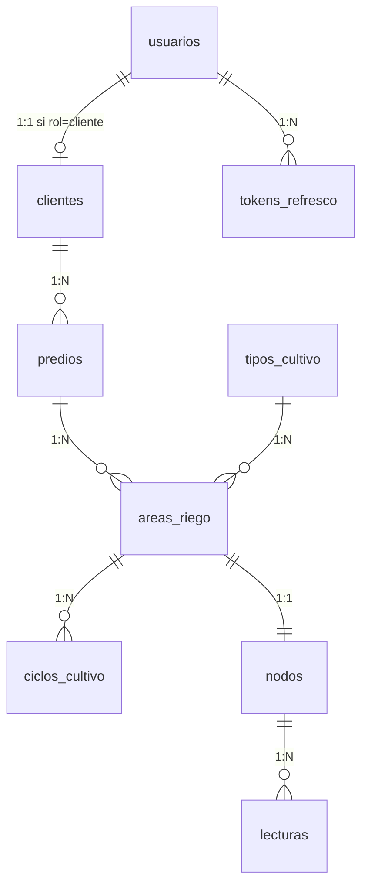

# Documentación de la Base de Datos — Sistema IoT de Riego Agrícola

> **Audiencia:** Desarrolladores del equipo.
> **Propósito:** Entender la estructura de la base de datos, por qué está diseñada así, cómo se relacionan las tablas entre sí, y cómo fluyen los datos desde el sensor hasta la pantalla del usuario.
> **Referencia técnica:** El SQL completo (DDL), queries de referencia y seed data están en `.agent/agente_base_de_datos.md`. Este documento **no duplica el SQL** — explica la lógica detrás del diseño.

---

## Tabla de Contenidos

1. [Vista General](#1-vista-general)
2. [Conceptos Clave del Diseño](#2-conceptos-clave-del-diseño)
3. [Tablas de Gestión de Usuarios](#3-tablas-de-gestión-de-usuarios) (3 tablas)
4. [Tablas de Estructura del Campo](#4-tablas-de-estructura-del-campo) (4 tablas)
5. [Tabla de Hardware IoT](#5-tabla-de-hardware-iot) (1 tabla)
6. [Tablas de Lecturas](#6-tablas-de-lecturas) (4 tablas)
7. [Flujo de Datos: De Sensor a Pantalla](#7-flujo-de-datos-de-sensor-a-pantalla)
8. [Índices: Qué Aceleran y Por Qué Existen](#8-índices-qué-aceleran-y-por-qué-existen)
9. [Reglas de Negocio Implementadas en el Backend](#9-reglas-de-negocio-implementadas-en-el-backend)
10. [Lo Que Viene en Fase 2](#10-lo-que-viene-en-fase-2)

---

## 1. Vista General

### La base de datos tiene 9 tablas organizadas en 4 grupos:

| Grupo | Tablas | Propósito |
|-------|--------|-----------|
| **Gestión de Usuarios** | `usuarios`, `tokens_refresco`, `clientes` | Quién entra al sistema, cómo se autentica, y sus datos de negocio |
| **Estructura del Campo** | `predios`, `tipos_cultivo`, `areas_riego`, `ciclos_cultivo` | Cómo está organizado el terreno del agricultor: fincas, parcelas, cultivos y temporadas |
| **Hardware IoT** | `nodos` | Los sensores físicos (o simulados) instalados en campo |
| **Lecturas de Sensores** | `lecturas`, `lecturas_suelo`, `lecturas_riego`, `lecturas_ambiental` | Los datos que llegan cada 10 minutos desde los nodos — es el corazón del sistema |

### Diagrama de Relaciones (ERD)



### La jerarquía del sistema: de arriba hacia abajo

Piensen en esto como una estructura de carpetas anidadas. Cada nivel "contiene" al siguiente:

```
👤 Cliente (el agricultor, ej. "Agrícola López S.A.")
 └── 🏡 Predio (un terreno, ej. "Rancho Norte")
      └── 🌱 Área de Riego (una parcela con un cultivo, ej. "Nogal Norte — 15.5 ha")
           ├── 📋 Tipo de Cultivo → viene del catálogo (ej. "Nogal")
           ├── 📅 Ciclo de Cultivo → la temporada actual (ej. "2026-02-01 a ...")
           └── 📡 Nodo IoT (el sensor, relación 1:1 con el área)
                └── 📊 Lecturas (144 por día = 1 cada 10 minutos con 12 campos dinámicos)
```

**¿Por qué importa esta jerarquía?** Porque define los permisos: un Cliente solo puede ver los datos que cuelgan debajo de él. Si Juan López es dueño de "Rancho Norte", solo ve las áreas, nodos y lecturas de ese predio — nunca los de otro cliente. El Admin puede ver todo.

---

## 2. Conceptos Clave del Diseño

Antes de entrar tabla por tabla, hay patrones que se repiten en toda la base de datos. Entender estos conceptos les va a facilitar leer cualquier tabla.

### Soft Delete (`eliminado_en`)

**¿Qué es?** En vez de borrar un registro de la base de datos (un `DELETE` real), le ponemos una fecha en el campo `eliminado_en`. El registro sigue existiendo en la tabla, pero todas las consultas normales lo ignoran con `WHERE eliminado_en IS NULL`.

**¿Por qué lo hacemos?** Por tres razones:
1. **Trazabilidad:** Si un admin borra un cliente por error, podemos ver qué se borró y cuándo.
2. **Integridad de datos:** Las lecturas históricas siguen haciendo referencia a un nodo/área que existió. Si borráramos en serio, perderíamos esa referencia.
3. **Fase 2:** La IA va a necesitar datos históricos completos para análisis. Borrar registros sería perder información valiosa.

**¿Dónde se usa?** En casi todas las tablas de gestión: `usuarios`, `clientes`, `predios`, `tipos_cultivo`, `areas_riego`, `ciclos_cultivo`, `nodos`. **NO** se usa en las tablas de lecturas — las lecturas nunca se borran, ni siquiera de forma lógica.

**Ejemplo práctico:** Si el admin "elimina" el predio "Rancho Norte", lo que pasa internamente es:
- `predios.eliminado_en = '2026-03-05 10:30:00'` (se marca con fecha)
- `WHERE eliminado_en IS NULL` lo excluye de los listados
- Pero el registro sigue ahí si alguien lo necesita consultar directamente

### Timestamps de Auditoría (`creado_en` y `actualizado_en`)

Casi todas las tablas tienen estos dos campos:
- **`creado_en`:** Se llena automáticamente cuando se inserta el registro. Nunca cambia después.
- **`actualizado_en`:** Se actualiza automáticamente cada vez que se modifica cualquier campo del registro.

Sirven para saber cuándo se creó cada cosa y cuándo fue la última vez que alguien la tocó. Es información básica de auditoría que todo sistema profesional necesita.

### Foreign Keys (FK): CASCADE vs RESTRICT

Una Foreign Key es una columna que apunta al `id` de otra tabla. Es la forma en que las tablas se conectan entre sí. Pero cuando se borra el registro padre, ¿qué pasa con los hijos? Hay dos comportamientos configurados en nuestra BD:

**`ON DELETE CASCADE` — "Si se va el padre, se van los hijos"**
Si borro un registro de `clientes`, automáticamente se borran todos sus `predios`, y en cadena sus `areas_riego`, `nodos` y `lecturas`. Es como borrar una carpeta: se borra todo lo que hay adentro.

> Se usa en la mayoría de las relaciones del sistema (clientes→predios, predios→áreas, nodos→lecturas, etc.) porque los datos hijos no tienen sentido sin su padre.

**`ON DELETE RESTRICT` — "No te dejo borrar si tiene hijos"**
Si intento borrar un tipo de cultivo (ej. "Nogal") pero hay áreas de riego que lo usan, la base de datos **me lo impide**. Me obliga a primero desasignar o eliminar esas áreas antes de poder tocar el cultivo.

> Se usa solo en `tipos_cultivo → areas_riego`. Protege contra borrar un cultivo que está en uso activo.

### Relaciones 1:1 vs 1:N

**1:N (uno a muchos) — "Un padre tiene muchos hijos"**
Es la relación más común. Un cliente tiene muchos predios. Un predio tiene muchas áreas. Un nodo tiene muchas lecturas. Se implementa poniendo una FK en la tabla hija (ej. `predios.cliente_id` apunta a `clientes.id`).

**1:1 (uno a uno) — "Exactamente un padre, exactamente un hijo"**
Se usa en dos casos específicos:
- **`usuarios` ↔ `clientes`:** Cada usuario con rol "cliente" tiene exactamente 1 registro en `clientes`. Se garantiza con `UNIQUE` en `clientes.usuario_id`.
- **`areas_riego` ↔ `nodos`:** Cada área tiene exactamente 1 nodo, y cada nodo pertenece a exactamente 1 área. Se garantiza con `UNIQUE` en `nodos.area_riego_id`.

¿Por qué separar en dos tablas si es 1:1? Porque la información es de naturaleza diferente. `usuarios` maneja auth (contraseña, rol), `clientes` maneja negocio (empresa, teléfono). Si mañana necesitamos que un cliente tenga 2 usuarios, solo quitamos el UNIQUE.

### BIGINT vs INT

- **INT:** Soporta hasta ~2,147 millones de registros. Se usa en la mayoría de tablas (usuarios, clientes, predios, etc.) porque nunca vamos a tener millones de clientes.
- **BIGINT:** Soporta hasta ~9.2 quintillones de registros. Se usa **solo en la tabla de lecturas** (`lecturas`) porque cada nodo genera 144 registros al día. Con muchos nodos y varios años de operación, los números crecen rápido.

### Índices

Un índice es como el índice de un libro: en vez de leer todas las páginas para encontrar un tema, vas directo al índice y saltas a la página exacta.

En la base de datos funciona igual. Sin índice, para buscar "todas las lecturas del nodo 5 entre febrero y marzo", MySQL tendría que revisar **todas** las filas de la tabla `lecturas` una por una. Con el índice `(nodo_id, marca_tiempo)`, salta directamente a las filas que necesita.

Los índices que tenemos están diseñados para acelerar las operaciones más frecuentes del sistema: buscar lecturas por nodo y fecha (dashboard), validar API Keys en cada POST del sensor, y buscar los predios de un cliente.

> **Trade-off:** Los índices aceleran las lecturas pero hacen los INSERT un poco más lentos (porque hay que actualizar el índice). Para nuestro caso vale la pena porque leemos datos (dashboard) mucho más seguido de lo que los escribimos.

### Todas las fechas en UTC

Todos los timestamps en la base de datos se almacenan en UTC (la hora universal, sin zona horaria). La conversión a la hora local del usuario (ej. hora de Chihuahua) se hace en el **frontend**, no en la BD ni en el backend. Esto evita problemas con diferentes zonas horarias y cambios de horario de verano.

### Nomenclatura: Español en BD, Inglés en API

Las tablas y columnas están en **español** (`lecturas`, `marca_tiempo`, `humedad`) para que el equipo las lea fácilmente. Pero la API REST y el JSON que viaja por la red están en **inglés** (`readings`, `timestamp`, `humidity`). La traducción entre ambos mundos se hace en la capa de serialización con los schemas de Pydantic.

---

## 3. Tablas de Gestión de Usuarios

Estas 3 tablas manejan quién puede entrar al sistema y cómo se identifica.

### 3.1. `usuarios` — Quién entra al sistema

**Propósito:** Guarda las credenciales de login (correo + contraseña hasheada) y el rol de cada persona que accede a la plataforma web.

**Columnas clave:**

| Columna | Qué guarda | Notas |
|---------|-----------|-------|
| `correo` | Email del usuario | Es único — no pueden haber dos usuarios con el mismo correo. Se usa como "username" para login. |
| `contrasena_hash` | La contraseña encriptada | Nunca guardamos la contraseña en texto plano. Se almacena el hash bcrypt. |
| `rol` | `'admin'` o `'cliente'` | Define qué puede hacer y qué puede ver. El admin ve todo; el cliente solo lo suyo. |
| `activo` | `true` / `false` | Permite deshabilitar un usuario temporalmente sin borrarlo. Un usuario con `activo = false` no puede hacer login. |

**¿Por qué separar `usuarios` de `clientes`?**
Porque no todo usuario es un cliente. El administrador es un usuario pero NO tiene datos de empresa, teléfono ni predios. Si tuviéramos todo en una sola tabla, las filas del admin tendrían muchas columnas vacías. Además, si mañana agregamos un rol nuevo (ej. "técnico de campo"), no tenemos que modificar la tabla de clientes.

**Dos formas de "desactivar" un usuario:**
- `activo = false` → Deshabilitado temporalmente. No puede hacer login, pero el registro está completamente visible en el sistema. Se puede reactivar poniendo `activo = true`.
- `eliminado_en = fecha` → Eliminado lógicamente (soft delete). Desaparece de los listados normales. Es más permanente.

### 3.2. `tokens_refresco` — Cómo funciona la sesión

**Propósito:** Almacena los refresh tokens activos de cada usuario. Son parte del mecanismo de autenticación JWT.

**¿Cómo funciona el flujo?** (simplificado):

```
1. Usuario hace login (correo + contraseña)
         ↓
2. El backend valida credenciales y genera:
   • Access Token (corta duración, ~15-30 min) → va en memoria del frontend
   • Refresh Token (larga duración, días) → se guarda en esta tabla
         ↓
3. El frontend envía el Access Token en cada petición (header Authorization)
         ↓
4. Cuando el Access Token expira, el frontend usa el Refresh Token
   para pedir uno nuevo, SIN que el usuario tenga que volver a escribir su contraseña
         ↓
5. Cuando el usuario hace logout, el Refresh Token se marca como revocado
   (se le pone fecha en `revocado_en`)
```

**Columnas clave:**

| Columna | Qué guarda | Notas |
|---------|-----------|-------|
| `token` | El refresh token (string largo único) | Se genera automáticamente al hacer login. |
| `expira_en` | Fecha/hora de expiración | Pasada esta fecha, el token ya no sirve aunque no esté revocado. |
| `revocado_en` | Fecha/hora de revocación | Si tiene valor → fue revocado (logout o rotación). `NULL` = todavía válido. |

**¿Por qué `ON DELETE CASCADE` con `usuarios`?** Si un usuario se borra, sus tokens de sesión no tienen sentido — se eliminan automáticamente.

### 3.3. `clientes` — El agricultor como entidad de negocio

**Propósito:** Guarda los datos comerciales del agricultor: nombre de la empresa, teléfono de contacto, dirección. Todo lo que NO es auth (credenciales) va aquí.

**Columnas clave:**

| Columna | Qué guarda | Notas |
|---------|-----------|-------|
| `usuario_id` | FK al usuario correspondiente | Es **UNIQUE** — un usuario solo puede ser un cliente. Un cliente solo tiene un usuario. |
| `nombre_empresa` | Nombre comercial del agricultor | Ej. "Agrícola López S.A.", "Rancho García". |
| `telefono` | Teléfono de contacto | Opcional. |
| `direccion` | Dirección comercial | Opcional. Texto libre. |

**Relación 1:1 con `usuarios`:**
Cada vez que el admin registra un nuevo cliente, se crean **dos registros**: uno en `usuarios` (con rol `'cliente'`, correo y contraseña) y otro en `clientes` (con el nombre de empresa y datos de contacto). El `usuario_id` en `clientes` apunta al registro de `usuarios`.

La llave `UNIQUE` en `usuario_id` garantiza que un usuario no pueda estar vinculado a dos clientes diferentes.

---

## 4. Tablas de Estructura del Campo

Estas 4 tablas modelan cómo está organizado físicamente el terreno del agricultor.

### 4.1. `predios` — Los terrenos del agricultor

**Propósito:** Cada registro es un terreno, rancho o finca que posee un cliente. Un cliente puede tener varios predios en diferentes ubicaciones geográficas.

**Columnas clave:**

| Columna | Qué guarda | Notas |
|---------|-----------|-------|
| `cliente_id` | FK al cliente dueño | Un cliente puede tener 1 o muchos predios (1:N). |
| `nombre` | Nombre del predio | Obligatorio. Ej. "Rancho Norte", "Parcela Sur". |
| `ubicacion` | Referencia geográfica textual | Texto libre descriptivo, ej. "Km 5 Carretera Delicias-Meoqui". **NO** es GPS — las coordenadas exactas van en los nodos. |

**Ejemplo de la vida real:**
El cliente "Agrícola López" tiene 2 predios:
- "Rancho Norte" en Km 5 Carretera Delicias
- "Parcela Sur" en Ejido Revolución

Cada uno puede tener múltiples áreas de riego con diferentes cultivos.

### 4.2. `tipos_cultivo` — El catálogo de cultivos

**Propósito:** Es el catálogo maestro de tipos de cultivo disponibles para asignar a las áreas de riego. Es **administrable**: el Admin puede agregar nuevos cultivos, editar nombres o eliminar los que ya no se usen.

**Columnas clave:**

| Columna | Qué guarda | Notas |
|---------|-----------|-------|
| `nombre` | Nombre del cultivo | **UNIQUE** — no puede haber dos cultivos con el mismo nombre. |
| `descripcion` | Nota opcional del admin | Ej. "Nogal pecanero", "Manzana Golden Delicious". Puede ser `NULL`. |

**Datos iniciales (seed data):**
Al instalar el sistema por primera vez, se cargan estos 6 cultivos:

| Nogal | Alfalfa | Manzana | Maíz | Chile | Algodón |
|-------|---------|---------|------|-------|---------|

El admin puede agregar más después (ej. "Sorgo", "Trigo", "Durazno") desde la plataforma web.

**Protección contra borrado accidental:**
La FK de `areas_riego → tipos_cultivo` tiene `ON DELETE RESTRICT`. Esto significa que si hay áreas de riego que usan el cultivo "Nogal", la base de datos **impide** borrar ese registro de `tipos_cultivo`. Primero habría que reasignar o eliminar esas áreas. Esto evita que un admin borre por error un cultivo que está en uso. Para "eliminarlo" sin borrar áreas, se usa soft delete (`eliminado_en`).

### 4.3. `areas_riego` — La entidad central del sistema

**Propósito:** Cada registro es una parcela dentro de un predio que tiene un sistema de riego monitoreado. Es la **entidad más importante** del sistema porque es donde **todo converge**: el cultivo que se siembra, el nodo que la monitorea, los ciclos de temporada, y por extensión todas las lecturas del sensor.

**Columnas clave:**

| Columna | Qué guarda | Notas |
|---------|-----------|-------|
| `predio_id` | FK al predio que contiene esta área | Un predio tiene 1 o muchas áreas (1:N). |
| `tipo_cultivo_id` | FK al catálogo de cultivos | Qué se siembra aquí. Apunta a `tipos_cultivo`. |
| `nombre` | Nombre descriptivo del área | Ej. "Nogal Norte", "Alfalfa Poniente". |
| `tamano_area` | Superficie en **hectáreas** | Ej. `15.50` = 15.5 hectáreas. Es un dato estático que se registra al configurar el área. Puede ser `NULL` si no se conoce. |

**¿Por qué es la entidad central?** Porque desde un área de riego puedes navegar hacia arriba (predio → cliente) para saber de quién es, hacia los lados (tipo de cultivo, ciclos) para saber qué hay sembrado y en qué temporada, y hacia abajo (nodo → lecturas) para ver los datos del sensor. Casi toda consulta del sistema pasa por esta tabla.

**Ejemplo:** El predio "Rancho Norte" del cliente López tiene 2 áreas de riego:
- "Nogal Norte" → 15.5 ha de Nogal, con el Nodo #1 monitoreándola
- "Alfalfa Poniente" → 8 ha de Alfalfa, con el Nodo #2 monitoreándola

### 4.4. `ciclos_cultivo` — Las temporadas agrícolas

**Propósito:** Registra las temporadas de cada área de riego. Cada ciclo tiene una fecha de inicio y una de fin. Sirven para que el cliente pueda ver el histórico organizado por temporada: "¿Cómo se comportó la humedad durante el ciclo 2025?"

**Columnas clave:**

| Columna | Qué guarda | Notas |
|---------|-----------|-------|
| `area_riego_id` | FK al área de riego | Un área puede tener muchos ciclos a lo largo de los años (1:N). |
| `fecha_inicio` | Cuándo empezó la temporada | Obligatorio. Formato DATE (solo fecha, sin hora). |
| `fecha_fin` | Cuándo terminó (o terminará) | Si es **NULL**, el ciclo está **activo** (en curso). |

**Regla de negocio importante: Solo 1 ciclo activo por área.**
No puede haber dos ciclos sin `fecha_fin` para la misma área. Si el admin quiere abrir un ciclo nuevo para "Nogal Norte", primero debe cerrar el anterior (poniéndole `fecha_fin`). Esta regla **no la controla la base de datos** — la valida el backend en el código.

**¿Cómo se usa para filtrar lecturas?**
Cuando un cliente selecciona un ciclo (ej. "Ciclo 2025" que va del 1-Mar-2025 al 15-Nov-2025), el sistema toma esas fechas y filtra: `WHERE lecturas.marca_tiempo BETWEEN '2025-03-01' AND '2025-11-15'`. El ciclo es simplemente un atajo para un rango de fechas.

**Ejemplo de historial de ciclos para "Nogal Norte":**

| Ciclo | Inicio | Fin | Estado |
|-------|--------|-----|--------|
| 2025 | 2025-03-01 | 2025-11-15 | Cerrado |
| 2026 | 2026-02-01 | — | **Activo** |

---

## 5. Tabla de Hardware IoT

### 5.1. `nodos` — Los sensores en campo

**Propósito:** Cada registro representa un sensor IoT (real o simulado) que está instalado en una parcela. Es el dispositivo que envía datos cada 10 minutos al servidor.

**Columnas clave:**

| Columna | Qué guarda | Notas |
|---------|-----------|-------|
| `area_riego_id` | FK al área que monitorea | **UNIQUE** — cada nodo está vinculado a exactamente 1 área, y cada área tiene exactamente 1 nodo (relación 1:1). |
| `api_key` | Credencial de autenticación | String largo y único (ej. `ak_n01_a1b2c3d4e5f6`). El simulador lo envía en el header `X-API-Key` de cada POST. Es la forma en que el servidor sabe qué nodo está hablando. **No expira.** |
| `numero_serie` | Identificador físico del dispositivo | Opcional. Para tracking de hardware. **UNIQUE** si se proporciona. |
| `nombre` | Nombre descriptivo | Ej. "Sensor Nogal Norte". Opcional pero recomendado para identificarlo en el dashboard. |
| `latitud` / `longitud` | Coordenadas GPS | Datos **estáticos** — se registran una sola vez al configurar el nodo. **NO** se envían en cada lectura. Servirán para la vista de mapas en Fase 2. |
| `activo` | `true` / `false` | Un nodo desactivado (`false`) no debería poder enviar lecturas. Similar a `activo` en usuarios. |

**Relación 1:1 con `areas_riego`:**
Cada nodo vigila exactamente un área, y cada área es vigilada por exactamente un nodo. Si un área no tiene nodo asignado, no recibe datos. La restricción `UNIQUE` en `area_riego_id` asegura que no se puedan asignar 2 nodos a la misma área.

**API Key — cómo funciona la autenticación del sensor:**
```
Simulador envía POST a /api/v1/readings
  → Header: X-API-Key: ak_n01_a1b2c3d4e5f6
  → El backend busca en la tabla nodos: WHERE api_key = 'ak_n01_...'
  → Si existe y activo = true → acepta la lectura y la asocia al nodo
  → Si no existe o activo = false → rechaza con error 401/403
```

---

## 6. Tabla de Lecturas (Unificada)

Esta tabla es **el corazón del sistema** — aquí viven los millones de datos que envían los sensores.

### 6.1. `lecturas` — Tabla Única (Wide Table)

**Propósito:** Almacena todos los datos emitidos por el nodo en un solo registro atómico en base de datos. Los campos que el sensor no reporte o que no apliquen llegarán como `NULL` (MySQL maneja los valores `NULL` eficientemente con un mapa de bits, sin penalizar el tamaño en disco).

**Columnas clave:**

| Grupo | Columna | Qué guarda | Notas |
|-------|---------|------------|-------|
| **Base** | `id` | Identificador único | **BIGINT** por el alto volumen previsto. |
| **Base** | `nodo_id` | FK al nodo | Conecta con `nodos.id`. |
| **Base** | `marca_tiempo` | Fecha de medición | Viene en el JSON como `timestamp`. Formato UTC. |
| **Base** | `creado_en` | Cuándo se guardó | Timestamp del servidor. |
| **Suelo** | `suelo_conductividad` | dS/m | Conductividad eléctrica del suelo. |
| **Suelo** | `suelo_temperatura` | °C | Temperatura radiando sobre el suelo. |
| **Suelo** | `suelo_humedad` | % | **⭐ DATO PRIORITARIO** |
| **Suelo** | `suelo_potencial_hidrico`| MPa | Siempre negativo. |
| **Riego** | `riego_activo` | booleano | `true`/`false`. ¿Está activa la bomba? |
| **Riego** | `riego_litros_acumulados`| L | Litros transcurridos en esta sesión. |
| **Riego** | `riego_flujo_por_minuto` | L/min | **⭐ DATO PRIORITARIO** |
| **Ambiente**| `ambiental_temperatura` | °C | Diferente a temperatura de suelo. |
| **Ambiente**| `ambiental_humedad_relativa`| % | Humedad en el aire. |
| **Ambiente**| `ambiental_velocidad_viento`| km/h | |
| **Ambiente**| `ambiental_radiacion_solar`| W/m² | Irradiación directa. |
| **Ambiente**| `ambiental_eto` | mm/día | **⭐ DATO PRIORITARIO** |

*Ventaja de diseño:* Consolidar la información ahorra las sub-consultas (JOIN) al momento de listar en el dashboard, y nos evita sobrecargar la BD con múltiples `INSERT` por cada ciclo de envío del sensor. El backend es el responsable de tomar el JSON que se divide en 3 objetos, "aplanarlo", y mapearlo a esta tabla de forma transparente.

---

## 7. Flujo de Datos: De Sensor a Pantalla

### A) Ingesta — Cuando el sensor envía datos

```
┌─────────────────┐
│   SIMULADOR      │  Envía POST cada 10 minutos
│   (PC local)     │  con el JSON de lectura
└──────┬──────────┘
       │ HTTP POST /api/v1/readings
       │ Header: X-API-Key: ak_n01_abc123...
       │ Body: { timestamp, soil:{...}, irrigation:{...}, environmental:{...} }
       ▼
┌─────────────────┐
│   BACKEND        │  1. Busca el api_key en tabla `nodos`
│   (FastAPI)      │  2. Verifica que el nodo está activo y no eliminado
│                  │  3. Abre una transacción de BD
└──────┬──────────┘
       ▼
┌─────────────────────────────────────────────────────────┐
│  INSERT atómico en `lecturas` (todo en un comando)      │
└─────────────────────────────────────────────────────────┘
```

**¿Por qué transacción atómica?** Si por alguna razón la inserción de `lecturas_riego` falla pero `lecturas` y `lecturas_suelo` ya se guardaron, tendríamos una lectura incompleta: datos de suelo sin datos de riego. La transacción garantiza que **o se guardan las 4 filas, o no se guarda ninguna**. Nunca hay datos parciales.

### B) Consulta — Cuando el usuario abre el dashboard

```
┌─────────────────┐
│   FRONTEND       │  Usuario abre el dashboard de "Nogal Norte"
│   (React)        │
└──────┬──────────┘
       │ GET /api/v1/readings?irrigation_area_id=1&start_date=...&end_date=...
       │ Header: Authorization: Bearer eyJhbGc...  (JWT del usuario)
       ▼
┌─────────────────┐
│   BACKEND        │  1. Valida el JWT → identifica al usuario
│   (FastAPI)      │  2. Verifica que el usuario tiene acceso a esa área
│                  │     (es suya o es admin)
│                  │  3. Ejecuta SELECT sobre la tabla lecturas
└──────┬──────────┘
       │ JSON con los 12 campos + marca_tiempo
       ▼
┌─────────────────┐
│   FRONTEND       │  Renderiza dashboard con gráficas y tarjetas
│   (React)        │  Destaca datos prioritarios (⭐)
│                  │  Muestra indicador de frescura: "Último dato: hace 12 min"
└─────────────────┘
```

### Indicador de Frescura

Cuando un nodo deja de enviar datos (falla de conexión, sensor apagado, etc.), el dashboard muestra:
- **Última lectura:** fecha y hora del último `marca_tiempo` recibido
- **Tiempo transcurrido:** cuánto ha pasado desde entonces (ej. "Hace 2 horas 30 min")

Esto se calcula comparando el `marca_tiempo` de la lectura más reciente contra la hora actual. Si un nodo envía cada 10 minutos y el último dato tiene más de 20 minutos, algo anda mal.

---

## 8. Índices: Qué Aceleran y Por Qué Existen

| Tabla | Índice | Qué query acelera |
|-------|--------|--------------------|
| `lecturas` | `(nodo_id, marca_tiempo)` | **El índice más importante.** Acelera la consulta principal del sistema: "Dame las lecturas del nodo X entre fecha A y fecha B". Se usa en el dashboard y en el histórico. Es compuesto porque siempre filtramos por nodo Y por fecha al mismo tiempo. |
| `lecturas` | `(marca_tiempo)` | Acelera extracciones masivas por rango de fecha sin filtrar por nodo específico. Pensado para las consultas de Fase 2 (reportes de IA que analizan datos de todos los nodos). |
| `nodos` | `(api_key)` UNIQUE | Acelera la validación de cada POST del simulador. Cada 10 minutos, cada nodo envía una lectura, y el backend busca el `api_key` para identificarlo. Sin este índice, buscaría fila por fila en la tabla de nodos. |
| `nodos` | `(area_riego_id)` UNIQUE | Además de garantizar la relación 1:1 (no se pueden asignar 2 nodos a la misma área), acelera la búsqueda "¿qué nodo tiene asignada el área X?". |
| `ciclos_cultivo` | `(area_riego_id, fecha_fin)` | Acelera la búsqueda del ciclo activo: "Para el área X, ¿cuál ciclo tiene `fecha_fin` NULL?". |
| `tokens_refresco` | `(token)` UNIQUE | Acelera la validación del refresh token cuando el frontend pide renovar la sesión. |
| `tokens_refresco` | `(usuario_id)` | Acelera listar o revocar todas las sesiones de un usuario (ej. "cerrar sesión en todos los dispositivos"). |
| `usuarios` | `(correo)` UNIQUE | Acelera el login (buscar por email). También garantiza que no haya correos duplicados. |
| `predios` | `(cliente_id)` | Acelera "dame todos los predios del cliente X". Se usa cada vez que un cliente entra a la plataforma. |
| `areas_riego` | `(predio_id)` | Acelera "dame todas las áreas del predio X". Se usa en la navegación jerárquica del dashboard. |
| `areas_riego` | `(tipo_cultivo_id)` | Acelera búsquedas por tipo de cultivo: "¿qué áreas tienen Nogal?". |

---

## 9. Reglas de Negocio Implementadas en el Backend

Estas reglas **no están en el SQL** (la base de datos no las valida por sí misma). Las verifica el código del backend antes de hacer INSERT o UPDATE. Es importante conocerlas porque afectan cómo se procesan las peticiones de la API.

| Regla | Qué verifica | Cuándo se verifica |
|-------|-------------|-------------------|
| **Solo 1 ciclo activo por área** | Antes de crear o actualizar un ciclo de cultivo, se comprueba que no exista otro ciclo con `fecha_fin IS NULL` para la misma `area_riego_id`. | Al crear (`POST`) o actualizar (`PUT`) un ciclo. |
| **Soft delete en cascada** | Al marcar un cliente como eliminado (`eliminado_en`), también se marcan como eliminados todos sus predios, áreas de riego, y nodos hijo. | Al hacer soft-delete de un cliente. |
| **No eliminar tipo de cultivo en uso** | Antes de eliminar (soft o hard) un tipo de cultivo, se verifica que no haya áreas de riego activas (no eliminadas) que lo usen. | Al eliminar (`DELETE`) un tipo de cultivo. |
| **Nodo solo a área sin nodo** | Al asignar un nodo a un área, se verifica que esa área no tenga ya otro nodo activo asignado. | Al crear (`POST`) o actualizar (`PUT`) un nodo. |
| **Filtrar eliminados por defecto** | Toda query de listado incluye `WHERE eliminado_en IS NULL` automáticamente. Los registros soft-deleted no aparecen en ningún endpoint GET normal. | En todas las consultas GET de listado. |
| **Nodo activo para aceptar lecturas** | Al recibir un POST de lectura, además de validar la API Key, se verifica que el nodo tenga `activo = true` y `eliminado_en IS NULL`. | Al recibir cada POST de lectura del simulador. |

---

## 10. Lo Que Viene en Fase 2

La base de datos del MVP está diseñada para soportar estas funcionalidades futuras **sin necesidad de reestructurar lo existente**. Aquí un resumen de las tablas que se agregarán:

| Tabla futura | Propósito | Se relaciona con... |
|-------------|-----------|---------------------|
| `umbrales` | Rangos configurables por el cliente para cada parámetro del sensor (ej. humedad óptima entre 20-30%). Permiten mostrar colores en el dashboard: verde = óptimo, amarillo = advertencia, rojo = crítico. | `areas_riego` |
| `alertas` | Historial de alertas generadas automáticamente cuando un valor sale de los umbrales configurados, o cuando un nodo deja de comunicarse por ≥20 minutos. | `nodos`, `areas_riego` |
| `preferencias_notificacion` | Configuración por usuario de qué alertas recibir y por qué canal (email, WhatsApp). | `usuarios`, `areas_riego` |
| `tokens_recuperacion` | Tokens temporales de un solo uso para el flujo "Olvidé mi contraseña". | `usuarios` |
| `audit_log` | Registro detallado de quién hizo qué cambio, en qué entidad, cuándo, y qué datos se modificaron. Vista exclusiva para el Admin. | `usuarios` |

Además, se evaluará agregar un campo `ndvi` (Índice de Vegetación) a la tabla `lecturas_suelo` cuando se defina la fuente de datos de imágenes satelitales.

> Ninguna de estas tablas se implementa en el MVP actual. Solo se mencionan para que el equipo entienda por qué el diseño actual tiene ciertas decisiones (como soft delete, timestamps en todo, y BIGINT en lecturas).

---

## Referencia Rápida — Las 9 Tablas del MVP

| # | Tabla | Grupo | Propósito en una línea | ID tipo |
|---|-------|-------|----------------------|---------|
| 1 | `usuarios` | Usuarios | Credenciales y rol de cada persona que accede al sistema | INT |
| 2 | `tokens_refresco` | Usuarios | Refresh tokens para mantener la sesión JWT | INT |
| 3 | `clientes` | Usuarios | Datos comerciales del agricultor (empresa, teléfono) | INT |
| 4 | `predios` | Campo | Terrenos/ranchos que posee cada cliente | INT |
| 5 | `tipos_cultivo` | Campo | Catálogo administrable de cultivos (Nogal, Alfalfa...) | INT |
| 6 | `areas_riego` | Campo | Parcelas con cultivo asignado — entidad central del sistema | INT |
| 7 | `ciclos_cultivo` | Campo | Temporadas agrícolas (inicio/fin) por área | INT |
| 8 | `nodos` | Hardware | Sensores IoT con API Key y coordenadas GPS | INT |
| 9 | `lecturas` | Lecturas | Registro centralizado con las 12 métricas dinámicas | BIGINT |
