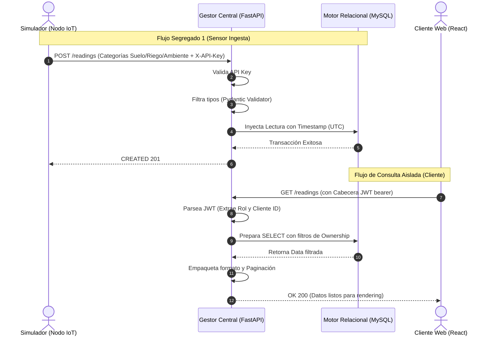

# Flujos de Información del Backend (FastAPI)

Este documento describe los procesos transaccionales, de seguridad y de persistencia de datos que ocurren en el servidor ("Cerebro" del sistema) para soportar la Fase MVP del sistema de monitoreo IoT.

### Diagrama del Flujo de Datos Transaccional (IoT -> Servidor -> Cliente)

---

## 1. Flujo de Ingesta IoT (El Camino del Sensor)

Es el flujo más crítico y de mayor volumen. Permite que las lecturas del hardware lleguen a la base de datos de manera normalizada y segura.

1. **Emisión:** El Módulo de Control (o Simulador) realiza una petición `POST /api/v1/readings`.
2. **Seguridad (Middleware):** El backend intercepta la petición y busca el header `X-API-Key`.
   - Si no existe o es inválido $\rightarrow$ HTTP 401 Unauthorized.
   - Si es válido, se relaciona inmediatamente con el `Nodo IoT` y el `Área de Riego` correspondiente en la base de datos.
3. **Validación Estricta (Pydantic):** El cuerpo JSON se filtra matemáticamente. Se espera la estructura de las **3 categorías dinámicas** (Suelo, Riego, Ambiental). Si faltan campos prioritarios, o los campos numéricos vienen como texto, la petición se rechaza con un HTTP 422.
4. **Persistencia:** Si todo es correcto, SQLAlchemy inyecta la lectura en MySQL añadiendo la marca de tiempo exacta (`timestamp`) y finaliza la transacción.
5. **Respuesta:** Se devuelve un `HTTP 201 Created` al nodo.

---

## 2. Flujo de Autenticación y Control de Acceso (Usuarios)

Garantiza que la información agrícola de un cliente sea completamente invisible para otros clientes.

1. **Login:** El cliente/admin envía sus credenciales a `POST /api/v1/auth/login`.
2. **Verificación:** El sistema compara el hash seguro `bcrypt`.
3. **Emisión de Tokens:** Se generan firmas JWT (JSON Web Tokens). Un token de corta duración (`access_token`) y uno de larga duración (`refresh_token`).
4. **Barrera de Propiedad (Ownership):**
   - En cualquier petición GET/POST a la API (ej. `/api/v1/properties`), la capa de seguridad extrae el rol y el ID del token JWT.
   - Si el rol es `cliente`, internamente inyecta cláusulas SQL (ej. `WHERE cliente_id = X`) en todas las consultas para evitar escapes de información (Data Leak).
   - Si el rol es `admin`, se le permite el acceso global.

---

## 3. Flujo de Consulta de Lecturas (Dashboard en Tiempo Real)

Cómo el backend procesa las solicitudes de la aplicación web y devuelve datos agregados.

1. **Solicitud de Históricos:** El Frontend dispara `GET /api/v1/readings` con filtros como `start_date`, `end_date`, `irrigation_area_id` o `crop_cycle_id`.
2. **Filtro Transaccional:** El servicio lee todos los registros y ensambla los promedios e indicadores de frescura (último timestamp).
3. **Paginación Embebida:** Para evitar sobrecargas de red al consultar miles de filas, el backend empaqueta los resultados en una estructura JSON paginada (ítems, total, página actual).

---

## 4. Flujo de Exportación de Datos

Permite al usuario extraer su telemetría fuera de la plataforma.

1. **Petición Tipificada:** Se recibe `GET /api/v1/readings/export?format=csv` (o `excel`, `pdf`).
2. **Acopio de Datos:** El servidor aplica exactamente los mismos filtros de ownership que en el Listado Normal.
3. **Renderizado en Memoria:**
   - Transforma los diccionarios SQLAlchemy a una representación tabular en buffers de memoria temporal (StringIO / BytesIO).
4. **Descarga Directa:** FastAPI retorna una `StreamingResponse` con las cabeceras MIME correctas (ej. `text/csv`) forzando la descarga inmediata del archivo en el navegador del usuario en lugar de mostrar texto crudo.

---

## 5. Flujos de Gestión (CRUD de Administrador)

El administrador interactúa con la estructura relacional a través del sistema de enrutamiento agrupado.

1. **Asignaciones Jerárquicas:** Creación encadenada de: `Clientes` $\rightarrow$ `Predios` $\rightarrow$ `Áreas de Riego` $\rightarrow$ `Ciclos de Cultivo` y `Nodos IoT` (relación 1:1 a un área).
2. **Gestión de Catálogos:** Operaciones estándar REST para administrar el catálogo global de Tipos de Cultivo (Nogal, Maíz, etc.).
3. **Borrados Suaves (Soft Delete):** Ninguna entidad crítica se elimina físicamente con sentencias `DROP` o `DELETE`. Se utiliza el campo `eliminado_en` (Timestamp). Cualquier registro con este campo deja de aparecer en los Endpoints de listado, manteniendo la integridad referencial intacta.
