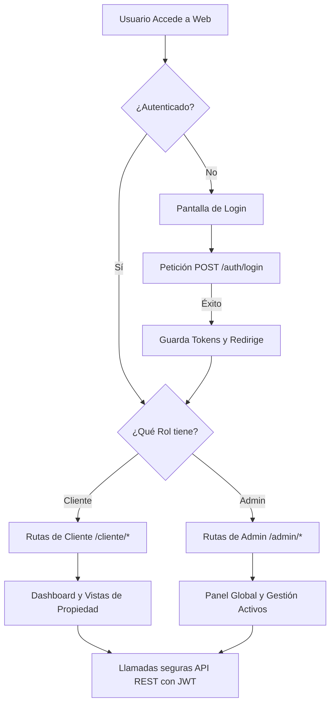

# Flujos de Informacion del Frontend (React App)

Este documento describe los flujos funcionales actuales de navegacion y consumo de datos en la aplicacion frontend para los roles **Administrador** y **Cliente**.

### Diagrama del Flujo Visual y Navegación

---

## 1. Flujo Base (Comun)

### 1.1 Autenticacion y enrutamiento por rol
1. La ruta raiz (`/`) aterriza en Login para usuarios no autenticados.
2. El formulario envia credenciales al backend con `axios`.
3. El backend responde `access_token` + `refresh_token`; el frontend guarda estado en `AuthContext` y persistencia local.
4. `ProtectedRoute` valida sesion y rol para redirigir:
   - Cliente: layout y rutas bajo `/cliente`.
   - Admin: layout y rutas bajo `/admin`.

### 1.2 Comportamiento transversal
- La app mantiene polling en vistas clave (dashboard/alertas) con guardas de concurrencia.
- El polling se pausa cuando la pestana esta inactiva (`usePageVisibility`).
- Las vistas de mapa se cargan en modo lazy (`Suspense`) y usan prefetch condicional desde navegacion para reducir tiempo de primera entrada.

---

## 2. Flujo de Cliente

El cliente consume informacion de sus propios recursos bajo ownership (predios, areas, nodos y lecturas).

### 2.1 Inicio y contexto operativo
- **Dashboard (`/cliente`)**: resumen de metricas prioritarias (humedad, flujo, ETO), estado por umbrales y frescura de datos.
- **Predios (`/cliente/areas`)**: seleccion de predio/area para fijar contexto.
- **Detalle de predio (`/cliente/predio/:predioId`)**: profundizacion por predio.

### 2.2 Geoespacial
- **Mapa cliente (`/cliente/mapa`)**:
  - Render de nodos por ownership con `GET /api/v1/nodes/geo`.
  - Filtros por predio y area.
  - Panel de detalle de nodo.
  - Leyenda persistente por estado y listado de nodos sin GPS.

### 2.3 Historico y exportacion
- **Historico (`/cliente/historico`)**: series por rango de fechas, filtros y consulta de disponibilidad.
- **Exportacion (`/cliente/exportar`)**: descarga de CSV/XLSX/PDF con filtros activos.

### 2.4 Operacion de alertas y configuracion
- **Alertas (`/cliente/alertas`)**: listado, filtros y marcado de leidas.
- **Umbrales (`/cliente/umbrales`)**: gestion de umbrales dentro de su ownership.
- **Notificaciones (`/cliente/notificaciones`)**: preferencias por area/severidad/canal y switch global.
- **Perfil (`/cliente/perfil`)**: gestion de datos de cuenta.

---

## 3. Flujo de Administrador

El admin tiene visibilidad global y CRUD de estructura operativa.

### 3.1 Supervision
- **Dashboard (`/admin`)**: vista agregada de clientes, nodos, lecturas y estado operacional.

### 3.2 Geoespacial global
- **Mapa admin (`/admin/mapa`)**:
  - Consulta global con filtros jerarquicos `cliente -> predio -> area`.
  - Modo de visualizacion por marcadores o clusters.
  - Capas por estado de frescura y leyenda con conteos.
  - Soporte para nodos sin GPS.

### 3.3 Gestion de jerarquia agricola
- **Clientes (`/admin/clientes`)**
- **Predios por cliente (`/admin/clientes/:clientId/predios`)**
- **Areas por predio (`/admin/predios/:predioId/areas`)**
- **Catalogo de cultivos (`/admin/cultivos`)**
- **Ciclos de cultivo (`/admin/ciclos`)**
- **Nodos (`/admin/nodos`, `/admin/nodos/:nodeId`)**

### 3.4 Gobierno operativo
- **Alertas (`/admin/alertas`)**
- **Umbrales (`/admin/umbrales`)**
- **Auditoria (`/admin/auditoria`)**

---

## 4. Flujo de datos frontend-backend

1. El frontend consume API versionada `/api/v1/*` usando la instancia `api` de Axios.
2. JWT se envia en `Authorization: Bearer <token>` para usuarios.
3. Consultas geoespaciales usan `GET /api/v1/nodes/geo` con filtros de ownership y jerarquia.
4. La API responde con payload tipado y paginacion en listados.
