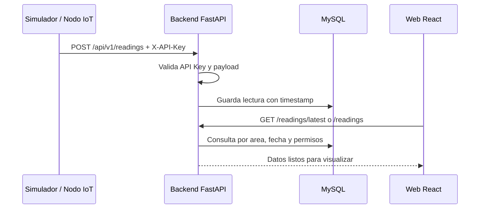
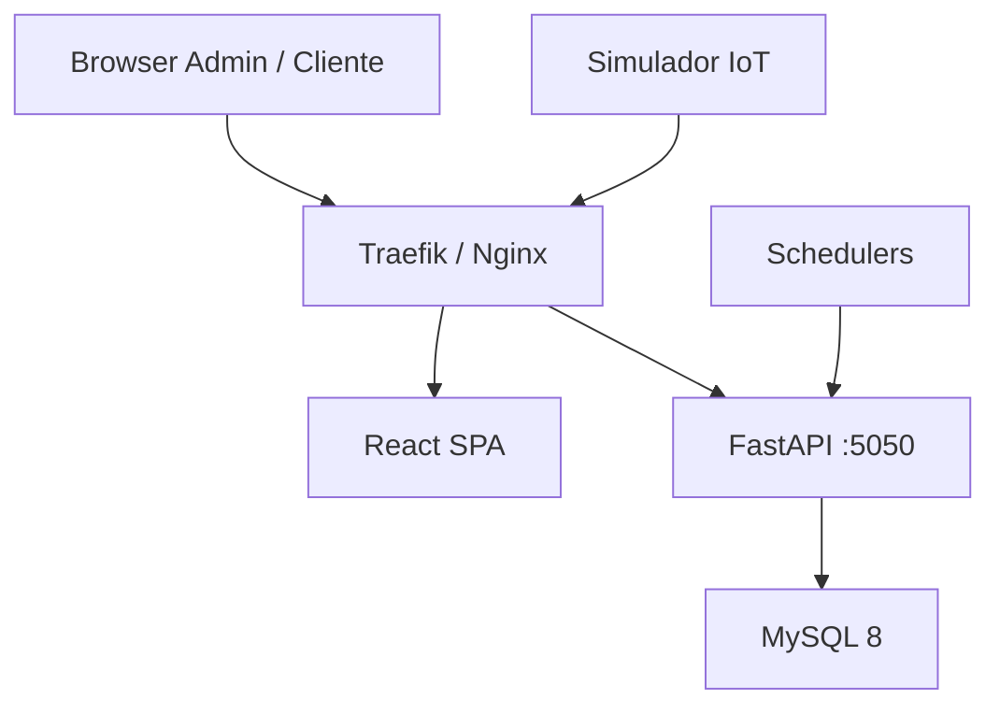

# Presentacion Pre-Demo - Sistema IoT de Riego Agricola

> Documento base para crear una presentacion de 8-10 minutos antes de iniciar la demo en vivo.
> Audiencia principal: cliente de negocio.
> Proposito: explicar rapidamente el valor del sistema, el recorrido del dato y que se va a demostrar.

---

## Como Usar Este Documento

Este archivo no es la presentacion visual final. Es un guion estructurado para que el equipo cree las diapositivas con el mismo orden, mensajes y evidencias.

Recomendaciones:

- Mantener 12-14 diapositivas maximo.
- Usar poco texto por slide y apoyar con capturas reales del sistema.
- Reservar la explicacion tecnica profunda para preguntas.
- No mostrar credenciales, API keys, secretos ni valores de `.env`.
- No presentar IA, n8n ni agentes como parte activa de esta demo. Si se mencionan, deben ir solo como roadmap futuro.

---

## Resumen Ejecutivo De La Presentacion

La plataforma permite monitorear sensores de riego agricola desde una aplicacion web. El sistema recibe lecturas de nodos IoT, las guarda en una base de datos, muestra indicadores clave para el cliente y permite consultar historicos, exportar informacion y operar alertas.

Mensaje central:

> "El objetivo no es solo ver datos: es convertir lecturas de campo en informacion accionable para decidir mejor el riego, detectar falta de comunicacion y conservar trazabilidad historica."

Duracion sugerida:

| Bloque | Tiempo |
|--------|--------|
| Problema y solucion | 2 min |
| Arquitectura y recorrido del dato | 2 min |
| Modulos funcionales | 3 min |
| Seguridad, despliegue y calidad | 1.5 min |
| Transicion a demo | 1 min |

---

## Slide 1 - Portada

**Titulo:** Sistema IoT de Riego Agricola

**Subtitulo:** Monitoreo web de sensores, historicos y alertas operativas para riego agricola.

**Contenido sugerido:**

- Plataforma web para monitorear nodos IoT de riego.
- Demo funcional con datos historicos y simulacion en vivo.
- Enfoque: visibilidad, trazabilidad y toma de decisiones.

**Visual sugerido:**

- Logo del proyecto desde `assets/imgs/logo.png`.
- Captura limpia del dashboard cliente o una imagen de campo agricola como fondo.

**Notas del presentador:**

> "Antes de entrar a la demo, vamos a ubicar rapidamente que resuelve el sistema y como fluye la informacion desde el sensor hasta la pantalla del usuario."

---

## Slide 2 - Problema Operativo

**Titulo:** El reto actual en campo

**Contenido sugerido:**

- Las lecturas de riego suelen depender de revision manual o datos dispersos.
- Cuando un nodo deja de comunicar, el usuario puede tardar en detectarlo.
- Sin historicos centralizados es dificil comparar ciclos, fechas y comportamiento del cultivo.
- La toma de decisiones pierde velocidad cuando no hay informacion reciente.

**Visual sugerido:**

- Diagrama simple: Campo -> datos dispersos -> decision tardia.
- Iconos de sensor, reloj, humedad y alerta.

**Notas del presentador:**

> "El problema no es solamente medir. El verdadero problema es saber si el dato llego, cuando llego y que significa para el riego."

---

## Slide 3 - Solucion Propuesta

**Titulo:** Una plataforma web para monitoreo agricola

**Contenido sugerido:**

- Ingesta automatica de lecturas desde nodos IoT o simulador.
- Dashboard por cliente, predio y area de riego.
- Historicos filtrables por fecha y ciclo de cultivo.
- Exportacion de datos en CSV, Excel y PDF.
- Alertas, umbrales, mapas y auditoria como parte del MVP extendido.

**Visual sugerido:**

- Captura del dashboard cliente.
- Tres bloques: Ingesta, Visualizacion, Accion.

**Notas del presentador:**

> "La plataforma concentra el proceso completo: recibe la lectura, la valida, la guarda y la convierte en una vista clara para el cliente."

---

## Slide 4 - Viaje Del Dato

**Titulo:** Del sensor al dashboard

**Contenido sugerido:**

1. El nodo o simulador envia una lectura por HTTP.
2. El backend valida la API Key del nodo.
3. FastAPI valida el payload y registra la lectura.
4. MySQL conserva el historico.
5. React consulta la API y actualiza dashboard, historicos y alertas.

**Visual sugerido:**

Usar este diagrama como base visual:



**Notas del presentador:**

> "Este es el viaje completo del dato. La demo va a mostrar justamente esta cadena funcionando: una lectura entra por backend y aparece reflejada en la interfaz."

---

## Slide 5 - Modelo Agricola Del Sistema

**Titulo:** Organizacion por cliente, predio y area

**Contenido sugerido:**

La informacion se organiza con una jerarquia clara:

```text
Cliente
  -> Predio
    -> Area de Riego
      -> Tipo de Cultivo
      -> Ciclo de Cultivo
      -> Nodo IoT
        -> Lecturas
```

Puntos clave:

- Cada cliente ve solo sus predios y areas.
- Cada area tiene un cultivo asignado.
- Cada area tiene ciclos de cultivo para separar temporadas.
- Cada nodo se vincula a un area y genera lecturas historicas.

**Visual sugerido:**

- Diagrama jerarquico de entidades.
- Tomar como referencia `docs/documentacion_base_de_datos.md`.

**Notas del presentador:**

> "Esta jerarquia es importante porque refleja como opera el cliente en campo: no ve sensores aislados, ve predios, areas, cultivos y temporadas."

---

## Slide 6 - Dashboard Cliente Y Datos Prioritarios

**Titulo:** Vista principal para el usuario final

**Contenido sugerido:**

El sistema recibe 3 categorias dinamicas:

| Categoria | Variables principales |
|-----------|-----------------------|
| Suelo | Conductividad, temperatura, humedad, potencial hidrico |
| Riego | Estado activo, litros acumulados, flujo por minuto |
| Ambiental | Temperatura, humedad relativa, viento, radiacion solar, ETO |

En el dashboard el cliente puede:

- Seleccionar predio y area de riego.
- Ver humedad de suelo, flujo de agua y ETO como indicadores principales.
- Revisar estado del riego y variables de suelo/ambiente.
- Observar graficas de comportamiento reciente.
- Ver si el dato esta fresco o si el nodo no ha reportado.

**Visual sugerido:**

- Captura de `frontend/src/app/pages/client/ClientDashboard.tsx` corriendo en navegador.
- Enmarcar las 3 tarjetas prioritarias: humedad, flujo y ETO.

**Notas del presentador:**

> "Aunque el sistema recibe doce variables dinamicas, la interfaz da mayor peso a los indicadores que mas impactan la decision de riego."

---

## Slide 7 - Frescura De Datos

**Titulo:** Saber cuando fue el ultimo dato

**Contenido sugerido:**

El sistema muestra continuidad operativa:

- Ultima lectura recibida.
- Tiempo transcurrido desde el ultimo dato.
- Estado visual del nodo: en linea, sin reporte reciente, sin conexion o sin lecturas.
- Base para detectar problemas de comunicacion antes de que pasen desapercibidos.

**Visual sugerido:**

- Captura del indicador de frescura en dashboard.
- Alternativa: mostrar una linea de tiempo con "ultima lectura -> ahora".

**Notas del presentador:**

> "En monitoreo IoT, un valor viejo puede verse normal pero ya no servir para decidir. Por eso el sistema no solo muestra el valor, tambien muestra su frescura."

---

## Slide 8 - Historicos Y Exportacion

**Titulo:** Analisis por fecha, ciclo y formato

**Contenido sugerido:**

El usuario puede:

- Consultar historicos por rango de fechas.
- Usar presets como hoy, ultimos 7 dias, ultimos 30 dias o mes actual.
- Filtrar por ciclo de cultivo.
- Descargar informacion en CSV, Excel o PDF.

**Visual sugerido:**

- Captura de `/cliente/historico`.
- Captura de `/cliente/exportar`.
- Iconos de CSV, Excel y PDF.

**Notas del presentador:**

> "La demo no se queda en tiempo real. Tambien muestra como el cliente recupera informacion historica para analizar decisiones pasadas o preparar reportes."

---

## Slide 9 - Operacion Administrativa

**Titulo:** Gestion completa de la estructura agricola

**Contenido sugerido:**

El administrador gestiona:

- Clientes y usuarios.
- Predios.
- Areas de riego.
- Catalogo de cultivos.
- Ciclos de cultivo.
- Nodos IoT y sus API Keys.
- Vista global de estado operativo.

**Visual sugerido:**

- Captura de `/admin`.
- Capturas pequenas de clientes, nodos y cultivos.
- Diagrama: Admin configura -> Cliente visualiza -> Nodo reporta.

**Notas del presentador:**

> "El administrador arma la estructura: quien es el cliente, que predios tiene, que areas se monitorean y que nodo esta instalado en cada area."

---

## Slide 10 - MVP Extendido: Alertas, Umbrales, Mapas Y Auditoria

**Titulo:** Funcionalidades listas para demostrar

**Contenido sugerido:**

El sistema ya cuenta con modulos adicionales activos:

- Umbrales por area y parametro.
- Alertas por valores fuera de rango.
- Alertas por inactividad de nodos.
- Campana y centro de alertas.
- Preferencias de notificacion por canal.
- Auditoria administrativa.
- Mapas para visualizar nodos con GPS.

**Visual sugerido:**

- Captura de campana `AlertsPopover`.
- Captura de centro de alertas.
- Captura de mapa cliente o admin.
- Captura de auditoria admin.

**Notas del presentador:**

> "Para la demo se puede mostrar el MVP base y tambien el MVP extendido: no solo vemos datos, tambien podemos reaccionar ante condiciones fuera de rango o falta de comunicacion."

---

## Slide 11 - Seguridad Y Privacidad

**Titulo:** Acceso separado para usuarios y nodos

**Contenido sugerido:**

Dos mecanismos de autenticacion:

| Actor | Autenticacion | Uso |
|-------|---------------|-----|
| Admin / Cliente | JWT | Acceso web y API REST |
| Nodo IoT / Simulador | Header `X-API-Key` | Solo ingesta de lecturas |

Controles clave:

- El cliente solo accede a sus propios predios, areas, nodos y lecturas.
- El admin tiene visibilidad global.
- Las lecturas de sensores no pueden consultarse con API Key.
- La API aplica filtros de ownership en consultas sensibles.

**Visual sugerido:**

- Diagrama con dos entradas: Usuario web y Nodo IoT.
- Candado o iconos de roles.

**Notas del presentador:**

> "La seguridad esta separada por tipo de actor. Un usuario entra con sesion web; un nodo solo puede escribir lecturas con su API Key."

---

## Slide 12 - Arquitectura, Despliegue Y Calidad

**Titulo:** Preparado para VPS Linux, Docker y validacion tecnica

**Contenido sugerido:**

Stack activo:

- Frontend: React SPA servido por Nginx.
- Backend: FastAPI + Uvicorn en puerto 5050.
- Base de datos: MySQL 8.
- ORM y migraciones: SQLAlchemy + Alembic.
- Despliegue: Docker Compose en VPS Linux.
- Reverse proxy: Traefik gestionado por Dokploy.

Elementos de confianza:

- API documentada automaticamente con Swagger/OpenAPI.
- Validacion estricta de datos con Pydantic.
- Migraciones de base de datos con Alembic.
- Pruebas backend con Pytest.
- Pruebas frontend con Vitest y TypeScript.
- Smoke tests y dataset demo reproducible.

**Visual sugerido:**

Usar como base el diagrama de `docs/arquitectura.md`:



Opcionalmente, agregar una captura pequena de Swagger UI en `/docs` o de pruebas pasando.

**Notas del presentador:**

> "La arquitectura esta desacoplada y verificable: frontend, backend y base de datos corren como servicios separados, con contratos documentados y pruebas para los flujos principales."

---

## Slide 13 - Guion De Demo En Vivo

**Titulo:** Que veremos en la demo

**Contenido sugerido:**

Orden recomendado:

1. Login como cliente.
2. Dashboard cliente: predio, area, humedad, flujo y ETO.
3. Frescura del dato y estado del nodo.
4. Ejecutar simulador en vivo y observar actualizacion.
5. Historico con filtros de fecha.
6. Exportacion CSV/XLSX/PDF.
7. Centro de alertas y campana.
8. Mapa de nodos.
9. Login o cambio a vista admin.
10. Admin dashboard y gestion de nodos/clientes/cultivos.
11. Umbrales y auditoria.

**Visual sugerido:**

- Timeline horizontal del recorrido.
- Iconos por modulo: login, dashboard, terminal, historico, exportacion, alertas, mapa, admin.

**Notas del presentador:**

> "Ahora que ya vimos la historia del sistema, pasamos a comprobarlo funcionando. La demo seguira el mismo recorrido: dato que entra, dato que se visualiza, y acciones que puede tomar cada rol."

---

## Slide 14 - Cierre

**Titulo:** Valor entregado

**Contenido sugerido:**

La plataforma ya permite:

- Centralizar lecturas de sensores de riego.
- Ver indicadores prioritarios para decision agricola.
- Detectar perdida de comunicacion.
- Consultar historicos y exportar datos.
- Operar clientes, predios, areas, cultivos, ciclos y nodos.
- Configurar umbrales, alertas, notificaciones, auditoria y mapas.

Roadmap futuro, fuera de la demo actual:

- NDVI cuando exista fuente de datos definida.
- Analitica avanzada.
- Automatizaciones externas.
- Asistente conversacional con IA.

**Visual sugerido:**

- Slide de cierre con 3 ideas: Visibilidad, Trazabilidad, Accion.

**Notas del presentador:**

> "El resultado es una base operativa solida: ya se puede monitorear, consultar, exportar y reaccionar. Lo avanzado queda preparado como evolucion, no como dependencia para que el sistema entregue valor hoy."

---

## Checklist Antes De La Demo

> Esta seccion es para uso interno del equipo. No proyectar credenciales ni API keys.

### 1. Preparar base de datos demo

Desde la raiz del proyecto:

```bash
make demo-seed
```

Este flujo carga:

- Usuarios de prueba.
- Cliente principal con predio y areas.
- Nodos activos.
- Historico de lecturas.
- Umbrales y alertas demo.

### 2. Levantar servicios principales

Backend:

```bash
cd backend
uv run uvicorn app.main:app --reload --port 5050
```

Frontend:

```bash
cd frontend
npm run dev
```

MySQL local, si no esta activo:

```bash
docker compose up -d mysql
```

### 3. Encender simulacion en vivo

Desde la raiz:

```bash
make demo-live
```

O desde `simulator/`:

```bash
python3 simulator_fast.py --quick-demo
```

### 4. Verificar rutas clave

Cliente:

- `/cliente`
- `/cliente/historico`
- `/cliente/exportar`
- `/cliente/alertas`
- `/cliente/mapa`
- `/cliente/umbrales`
- `/cliente/notificaciones`

Admin:

- `/admin`
- `/admin/clientes`
- `/admin/nodos`
- `/admin/cultivos`
- `/admin/ciclos`
- `/admin/alertas`
- `/admin/umbrales`
- `/admin/auditoria`
- `/admin/mapa`

API:

- `/health`
- `/docs`
- `/api/v1/readings/latest`
- `/api/v1/readings/export`
- `/api/v1/alerts`
- `/api/v1/nodes/geo`

### 5. Datos sensibles

- Consultar credenciales de prueba y API keys en `TEST_DATA.md` solo de forma interna.
- No incluir `TEST_DATA.md`, `backend/.env` ni API keys en capturas proyectables.
- Si se muestra una terminal, cuidar que no queden tokens, secretos o headers completos visibles.

---

## Evidencias Visuales Recomendadas

| Evidencia | Donde obtenerla | Uso en presentacion |
|-----------|-----------------|---------------------|
| Dashboard cliente | `/cliente` | Slides 3, 6 y demo |
| Indicador de frescura | `/cliente` | Slide 7 |
| Historico | `/cliente/historico` | Slide 8 |
| Exportacion | `/cliente/exportar` | Slide 8 |
| Centro de alertas | `/cliente/alertas` o `/admin/alertas` | Slide 10 |
| Campana de alertas | Layout global | Slide 10 |
| Mapa | `/cliente/mapa` o `/admin/mapa` | Slide 10 |
| Admin dashboard | `/admin` | Slide 9 |
| Swagger/OpenAPI | `http://localhost:5050/docs` | Slide 12 |
| Terminal simulador | `simulator_fast.py --quick-demo` | Slide 13 |

---

## Fuentes Del Proyecto Consultadas Para El Guion

- `README.md`: stack, demo reproducible, despliegue y comandos.
- `docs/arquitectura.md`: arquitectura, flujo de datos, autenticacion y MVP extendido.
- `docs/documentacion_base_de_datos.md`: jerarquia, tablas, reglas de negocio y frescura.
- `docs/documentacion_api.md`: endpoints, convenciones y flujo completo.
- `docs/flujos_frontend.md`: pantallas por rol y navegacion.
- `docs/flujos_backend.md`: ingesta, seguridad, consultas y exportacion.
- `docs/design_system.md`: estilo visual recomendado.
- `docs/testing.md`: estrategia de QA.
- `docs/Reporte_Ejecutivo_QA.md`: narrativa ejecutiva de calidad y evidencias.
