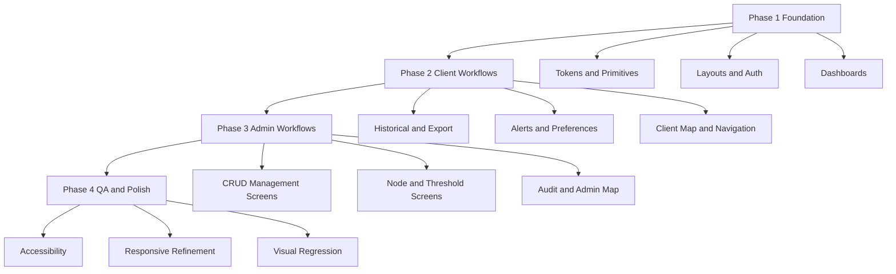

# UX UI Redesign Master Plan

## Goal
Deliver a full frontend UX UI redesign in phased execution, aligned with the design system and including polished light mode and dark mode.

## Design System Commitment
1. Light theme will strictly preserve the visual language defined in the design system.
2. Dark theme will follow Direction B Espresso Glass but derived from the same organic and earthy principles.
3. Dark theme will not copy exact light hex values, but every token will keep semantic and stylistic coherence with the system.
4. Typography, bento spacing, border radius, and interaction rules remain consistent across both modes.

## Inputs Reviewed
- Design baseline from docs/design_system.md
- Current theme tokens and dual mode setup from frontend/src/styles/theme.css
- Current route map and screen inventory from frontend/src/app/routes.tsx
- Current login implementation from frontend/src/app/pages/auth/LoginPage.tsx
- Current client dashboard implementation from frontend/src/app/pages/client/ClientDashboard.tsx
- Current bento card component baseline from frontend/src/app/components/BentoCard.tsx

## Current State Findings
1. Theme infrastructure is already prepared for dual mode and can be extended instead of rebuilt.
2. Dark mode already exists and is close to your visual reference style.
3. Main visual drift against the design system is in typography, spacing consistency, card hierarchy, and interaction polish.
4. Full redesign should be executed by impact order to reduce risk and keep UI usable at every phase.

## Visual Directions

### Light Mode Direction
### Organic Daylight Bento
- Keep warm cream base and original token intent from the design system.
- Increase card separation by surface contrast, not heavy shadows.
- Use elegant serif only for headlines and key section titles.
- Preserve rounded geometry and pill controls.
- Prioritize readability for dense operational pages.

### Dark Mode Direction A
### Midnight Olive Control Center
- Near black backgrounds with olive and gold accents.
- Minimal glow only in priority metrics and live status.
- Crisp off white typography with muted warm secondary text.
- Fits your reference style most directly.

### Dark Mode Direction B
### Espresso Glass Premium
- Dark brown charcoal surfaces with stronger glass effect.
- Softer contrast and warmer appearance.
- Better for branding warmth, slightly less technical than Direction A.
- All tokens mapped semantically from the original light design system family.

## Recommended Direction
Use Direction B as default dark mode.

Reason:
- Better alignment with the earthy premium style requested.
- Keeps a warm organic identity while maintaining monitoring clarity.
- Enables dark mode personality without breaking design system consistency.

## Design System Compliance Matrix

### Must remain unchanged from system intent
1. Bento layout as primary composition model.
2. Rounded geometry with 32px cards, 24px icon containers, pill buttons.
3. Flat visual style with minimal shadow and subtle hover behavior.
4. Serif for large titles and sans for data, labels, and controls.
5. Priority hierarchy for soil humidity, flow per minute, and eto.

### Can adapt for dark mode with coherence
1. Surface hex values can shift to espresso and charcoal variants.
2. Accent tones can increase brightness slightly for contrast.
3. Borders and overlays can use translucent warm neutrals.
4. Glow usage stays minimal and only for live priority cues.

### Guardrails for dark mode Direction B
1. No neon palette and no cold bluish dominance.
2. No heavy shadow stacks that break flat premium feel.
3. No geometry changes between light and dark.
4. Preserve readability contrast in cards, forms, and tables.

## Dual Theme Token Strategy

### Keep existing core variable names
- Use current token architecture and refine values.

### Token mapping rule
- Light tokens remain source of truth for semantics.
- Dark tokens are mapped by role, not by direct color inversion.
- Example mapping
  - light bg base to dark bg base with same role depth
  - light accent green to dark accent green with contrast tuned
  - light text main to dark text main with equivalent readability tier

### Add semantic token layer
- --surface-page
- --surface-panel
- --surface-card-primary
- --surface-card-secondary
- --text-title
- --text-body
- --text-subtle
- --state-live
- --state-warning
- --state-critical
- --focus-ring
- --chart-priority-1
- --chart-priority-2
- --chart-priority-3

### Interaction and accessibility tokens
- --hover-overlay
- --pressed-overlay
- --disabled-opacity
- --outline-contrast

## Component Redesign Blueprint

### Global shell
- Sidebar and header visual hierarchy
- Consistent active state chips
- Theme toggle placement and persistence feedback

### Auth
- Split hero plus form layout for desktop
- Compact one column layout for mobile
- Strong visual identity with priority data chips

### Dashboard Client
- Priority cards at top with strongest visual weight
- Freshness indicator always visible near area selector
- Unified chart card grammar for all metrics

### Dashboard Admin
- KPI first row, operational second row, alerts and audit third row
- Maintain same card grammar as client view to reduce cognitive load

### Data heavy pages
- Historical, export, thresholds, alerts, audit logs
- New table system with sticky header, filter toolbar, row states
- Consistent empty, loading, and error states

### Form heavy pages
- Clients, properties, areas, crop types, cycles, nodes, profile
- Multi section forms with clear group titles and helper text
- Inline validation and success feedback system

### Map pages
- Map canvas with floating bento info panel
- Node status legend in both themes

## Full Frontend Rollout by Impact

### Phase 1 Foundation and high traffic pages
1. Theme token refinement and component primitives
2. Layout shells and navigation
3. Login, forgot password, reset password
4. Client dashboard
5. Admin dashboard

### Phase 2 Core user workflows
1. Historical data
2. Export data
3. Alerts center
4. Notification preferences
5. Area selector and property detail
6. Client map

### Phase 3 Admin operations
1. Client management
2. Property management
3. Irrigation area management
4. Crop type management
5. Crop cycle management
6. Node management and node detail
7. Threshold management
8. Audit logs
9. Admin map

### Phase 4 Quality and consistency pass
1. Accessibility and keyboard flow
2. Responsive refinements
3. Animation and micro interaction balance
4. Visual regression checks

## Execution Map for Code Mode

### Step order
1. Theme and token foundation
2. Core primitives and shared components
3. Layout shells
4. Auth pages
5. Dashboards
6. Data pages
7. Admin management pages
8. Final polish and QA

### Primary files to update first
- frontend/src/styles/theme.css
- frontend/src/styles/index.css
- frontend/src/app/components/BentoCard.tsx
- frontend/src/app/components/PillButton.tsx
- frontend/src/app/layouts/ClientLayout.tsx
- frontend/src/app/layouts/AdminLayout.tsx
- frontend/src/app/pages/auth/LoginPage.tsx
- frontend/src/app/pages/client/ClientDashboard.tsx
- frontend/src/app/pages/admin/AdminDashboard.tsx

## UX Rules for MVP Domain
1. Prioritize visibility of soil humidity, flow per minute, and eto.
2. Keep freshness state visible in dashboard header and metric cards.
3. Preserve hierarchy of client, property, irrigation area selection.
4. Maintain simple predictable interactions and avoid noisy effects.

## Mermaid Flow

## Acceptance Criteria
1. Light and dark mode parity in all screens.
2. All screens comply with bento geometry and spacing rules.
3. Priority metrics have strongest visual prominence.
4. Every major view has clear loading, empty, and error states.
5. Navigation and forms are consistent across admin and client roles.
